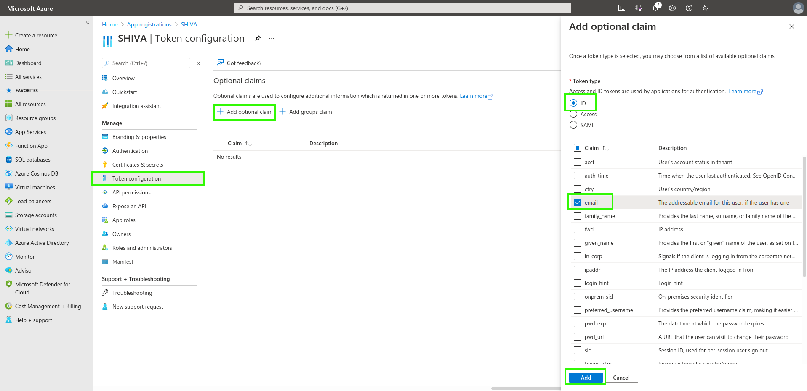
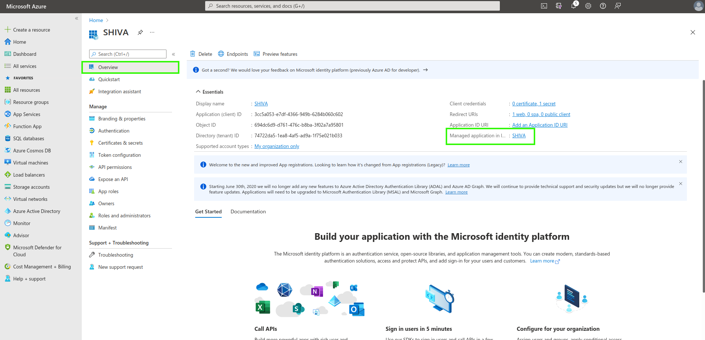
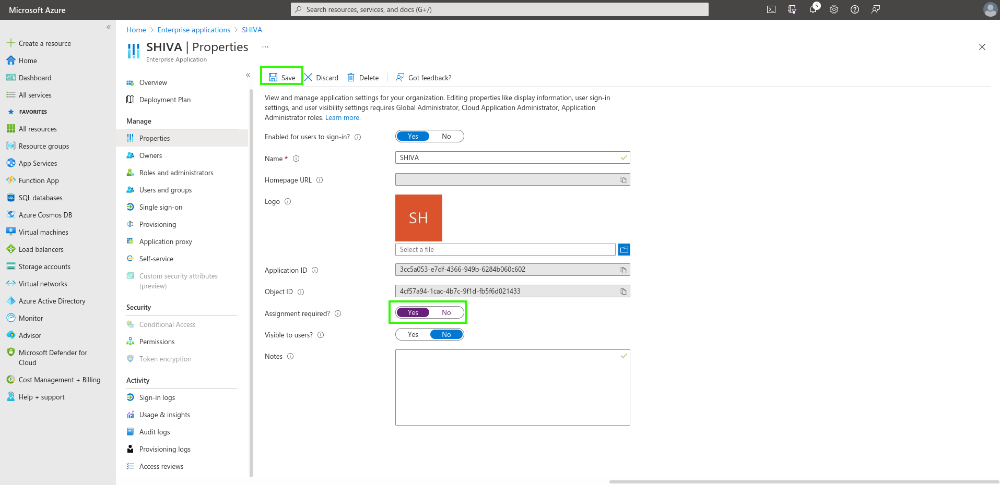

Ecco un esempio di configurazione del repository di autenticazione di un'organizzazione Cloud Temple con __Microsoft EntraID__ (Azure Active Directory).  

Configurare il tuo repository Microsoft a livello di un'organizzazione Cloud Temple facilita l'autenticazione dei tuoi utenti sulla console Shiva. Questo consente di evitare la moltiplicazione dei fattori di autenticazione e di ridurre la superficie di attacco.  

Se i tuoi utenti sono autenticati al loro account Microsoft, l'autenticazione ai servizi della console Shiva sarà trasparente.

Ecco i vari passaggi per realizzare questa configurazione:


## Fase 1: Configurazione del SSO lato Microsoft Azure

### Registrazione di una nuova applicazione Azure (portale Azure)

Per creare l'__app registration__, bisogna accedere al portale Microsoft Azure, poi in Microsoft EntraID, __"ADD > App Registration"__ 

Nella pagina "Register an application", indicare:
```
- __Name__ : Indicare "__SHIVA__"
- __Supported account types__ :  __Accounts in this organizational directory only__ (__<Tuo Tenant Azure>__ only - Single tenant) 
- __Redirect URL__ : Non impostare in un primo momento. L'URL sarà fornito dal supporto Cloud Temple e sarà aggiunto in questo campo più tardi.
```


Le informazioni **Application (client) ID** e **Directory (tenant) ID** sono le informazioni utili da fornire nella richiesta di supporto al team Cloud Temple per attivare l'autenticazione Microsoft EntraID a livello della tua organizzazione.


### Definizione di un segreto
Nella scheda "Certificates & secrets", creare un nuovo segreto.  

*Nota: la data di scadenza del segreto non può essere superiore a 24 mesi, anche con una data di scadenza personalizzata.*


Il segreto generato sarà fornito nella richiesta di supporto:


### Definizione del token EntraID 

Il token EntraID è necessario per configurare l'autenticazione.  

Nel menu __"Token Configuration"__, cliccare su __"Add optional claim"__. Occorrerà selezionare "ID" come tipo di token e spuntare "email".



L'interfaccia Azure ti chiederà se desideri aggiungere un permesso che ti permetterà di leggere l'email di un utente (Microsoft Graph email), spunta la casella e conferma.


Poi, vai su "API permissions" e clicca su __"Grant admin consent for Cloud Temple"__.


### Configurazioni di sicurezza aggiuntive (opzionale ma raccomandato)

Per impostazione predefinita, Microsoft EntraID come configurato darà a qualsiasi utente del tuo tenant Azure la possibilità di connettersi alla tua organizzazione Cloud Temple.
È possibile restringere a livello di __"App Registration"__ gli accessi per autorizzare solo una lista di utenti o gruppi a connettersi alla tua organizzazione Cloud Temple.

Ecco la procedura da seguire;

#### Accedere alle impostazioni aggiuntive "App Registration"
##### Opzione 1 
Vai sulla scheda "Overview" poi clicca sul nome dell'applicazione (il link situato a lato di "Managed application").



##### Opzione 2 
Accedi alle "Enterprise applications" e cerca utilizzando il nome dell'applicazione creata precedentemente.


#### Restrizione dell'autenticazione agli utenti assegnati all'applicazione

Indicare qui la necessità di un'assegnazione dell'utente all'applicazione per autorizzare la sua autenticazione:



#### Assegnazione degli utenti e dei gruppi all'applicazione
Solo i gruppi e gli utenti assegnati all'applicazione potranno connettersi alla tua organizzazione Cloud Temple tramite l'app registration.


Infine, sarà sufficiente applicare l'assegnazione cliccando su "Assign".


Ora gli utenti assegnati all'applicazione potranno connettersi alla tua organizzazione Cloud Temple tramite l'applicazione creata.

## Fase 2: Richiedere la configurazione del SSO (Single Sign-On) della tua organizzazione

Questa parte della configurazione viene effettuata a livello di organizzazione dal team Cloud Temple.  

Per farlo, fai __una richiesta di assistenza__ nella console indicando il tuo desiderio di configurare un SSO Microsoft EntraID.  

Si prega di fornire le seguenti informazioni nella richiesta di assistenza:

    Il nome della tua Organizzazione
    Il nome di un contatto con la sua e-mail e n. di telefono per finalizzare la configurazione
    Application ID (identificatore univoco associato all'applicazione creata precedentemente)
    Directory ID (corrisponde all'identificatore Azure AD del tenant Azure)
    Secret (segreto associato all'applicazione creata precedentemente)

Non appena la configurazione è realizzata lato console Shiva, il contatto indicato sarà informato.

## Fase 3: Finalizzazione della configurazione

Nella pagina iniziale dell’App Registration, nel menu overview, cliccare su "Add a Redirect URL".


Poi, vai su "Add a platform" e aggiungi una di tipo Web.


Sarà sufficiente inserire la "Redirect URL" fornita dal Team Prodotti Applicazioni.


Dovresti ottenere questo risultato una volta aggiunta la "Redirect URL".


La configurazione della "Redirect URL" può richiedere alcuni minuti per essere effettiva.
Una volta completati tutti i passaggi, puoi autenticarti alla tua organizzazione Cloud Temple tramite il tuo SSO.

