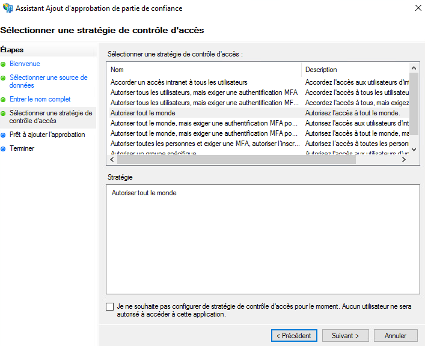

Ecco un esempio di configurazione del repository di autenticazione di un'organizzazione Cloud Temple con __Microsoft ADFS__.

La configurazione del repository Microsoft a livello di un'organizzazione Cloud Temple facilita l'autenticazione dei vostri utenti sulla console Shiva.
Questo permette di evitare la moltiplicazione dei fattori di autenticazione e di ridurre la superficie di attacco.
Se i vostri utenti sono autenticati al loro account Microsoft, l'autenticazione ai servizi della console Shiva sarà trasparente.

Ecco le diverse fasi per realizzare questa configurazione:


## Prerequisiti
Il vostro server Microsoft ADFS deve poter accedere all'URL Cloud Temple seguente: https://keycloak-shiva.cloud-temple.com/auth/.

L'ADFS deve essere accessibile dalle reti di Cloud Temple e __esporre un certificato TLS di una CA pubblica__.

Gli utenti che desiderano connettersi al portale devono avere la loro email, nome e cognome inseriti nell'Active Directory.

## Fase 2: Richiedere la configurazione del SSO (Single Sign-On) della vostra organizzazione

Questa parte della configurazione viene effettuata a livello dell'organizzazione dal team Cloud Temple.

Per farlo, effettuate __una richiesta di assistenza__ nella console indicando il vostro desiderio di configurare il vostro repository di autenticazione Microsoft ADFS.

Si prega di fornire le seguenti informazioni nella richiesta di assistenza:
```
    Il nome della vostra Organizzazione
    Il nome di un contatto con la sua email e n° di telefono per finalizzare la configurazione
    URL pubblica dei Metadata della federazione dell'ADFS (<nome di dominio dell'adfs>/FederationMetadata/2007-06/FederationMetadata.xml)
    (Esempio: https://adfs.test.local/FederationMetadata/2007-06/FederationMetadata.xml)
```
Non appena la configurazione è realizzata lato console Shiva, il contatto indicato sarà informato.

Il team di supporto Cloud Temple vi trasmetterà un URL che assomiglierà a questo: https://keycloak-shiva.cloud-temple.com/auth/realms/companytest/broker/adfs_test/endpoint/descriptor

*Potete incollare l'URL in un browser per testarlo. Se funziona correttamente dovreste vedere apparire un XML*

## Fase 3: Realizzazione della configurazione ADFS
### Configurazione della federazione di autenticazione

#### Aggiunta di un'approvazione di parte fidata

Sul vostro server ADFS, andate in __"Aggiungi un'approvazione di parte fidata"__.


### Configurare i "claims"
I claims permettono di fornire informazioni al token che sarà trasmesso alla console Cloud Temple.

Trasmettono le informazioni dell'utente connesso che sono necessarie al buon funzionamento dei diversi servizi, come la sua email, il suo nome e cognome.


Selezionate "Importa i dati, pubblicati online o su una rete locale, riguardanti la parte fidata" e inserite l'URL fornito dal supporto Cloud Temple.


Potete inserire un nome e una descrizione per la parte fidata, questa parte è opzionale.


Per impostazione predefinita, autorizziamo tutti, ma è possibile selezionare __"Autorizza un gruppo specifico"__ per selezionare il gruppo o i gruppi che saranno autorizzati ad accedere ai servizi della console Shiva tramite l'ADFS.



Una volta completate tutte queste fasi, avete terminato la configurazione della parte fidata.


Sarà poi necessario modificare la strategia di emissione di rivendicazione di questa nuova parte fidata.


Cliccate su "Aggiungi una regola" e specificate il modello, ovvero "Trasformare una rivendicazione in entrata".


Dovrete solo inserire le informazioni come indicato nella schermata qui sotto.


### Aggiungere i claims
Aggiungete una seconda regola con, questa volta, il modello "Inviare gli attributi LDAP come rivendicazioni".


Selezionate il magazzino di attributi e aggiungete gli attributi "Indirizzi E-Mail, Nome, Cognome e Nome-Account-SAM" come indicato nella schermata qui sotto.


È sufficiente applicare le modifiche.

## Fase 3: Finalizzazione

Ora potete testare andando sulla console Shiva e cliccando sul pulsante corrispondente all'autenticazione ADFS client; in questo esempio, si tratta di __"ADFS Test"__


