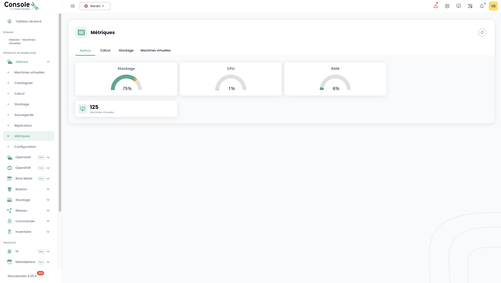

## Concept

La maggior parte dei clienti __Cloud Temple__ dispongono di strumenti di visualizzazione, monitoraggio e metrologia per il monitoraggio delle loro operazioni.

La filosofia della console Shiva è di permettere l'accesso ai dati per integrarsi in questi strumenti tramite un proxy prometheus integrato.

Questo proxy consente di interrogare e manipolare i dati da uno strumento di visualizzazione come [Grafana](https://grafana.com).

È comunque possibile visualizzare alcuni dati di prestazioni delle vostre risorse Cloud nell'interfaccia web della console Shiva.

*__Nota:__ La filosofia __Cloud Temple__ non è quella di integrare più grafici nell'interfaccia web, ma di offrire il massimo delle informazioni accessibili tramite l'API*

## Dashboard integrato nell'interfaccia web

*__Nota:__ Per accedere a questi dashboard, è necessario possedere il diritto __'metric_read'__*

### Monitoraggio delle emissioni di carbonio per il calcolo

Il dashboard della console Shiva integra di default un grafico di monitoraggio del consumo elettrico del vostro calcolo nonché la stima delle emissioni di carbonio associate.

È accessibile direttamente nella pagina principale dell'interfaccia web della console Cloud Temple, cliccando su __'Metric'__ :

### Vista globale della salute delle macchine virtuali

La sintesi dello stato delle macchine virtuali è accessibile nel menu __'IaaS'__ a sinistra dello schermo, nel sottomenu __'Salute'__ poi __'Macchine virtuali'__

Questa sintesi fornisce, sull'intervallo di tempo selezionato in __'Filtri'__:

- il numero di CPU e la __media di utilizzo della CPU__,
- il numero di GB di memoria e la __media di utilizzo della memoria__,
- Le medie di __latenza di accesso allo storage__ in lettura e in scrittura,
- Il __'CPU Ready'__ medio della macchina virtuale (che corrisponde al tempo medio di attesa della disponibilità di un core fisico da parte della macchina virtuale).

Per ogni VM, è possibile accedere alla cronologia delle sue prestazioni cliccando sull'icona verde __'Storico'__ della macchina virtuale nella colonna azione. :

Si accede così alla pagina di visualizzazione grafica dei dati storicizzati, che include una vista __performance ambientale__ :

## Utilizzo con __Grafana__

È possibile per la console Shiva di servire come __datasource__ per la vostra infrastruttura [Grafana](https://grafana.com).

Troverete un insieme di __esempi di configurazione per Grafana__ qui:

https://github.com/Cloud-Temple/console-grafana-iaas

