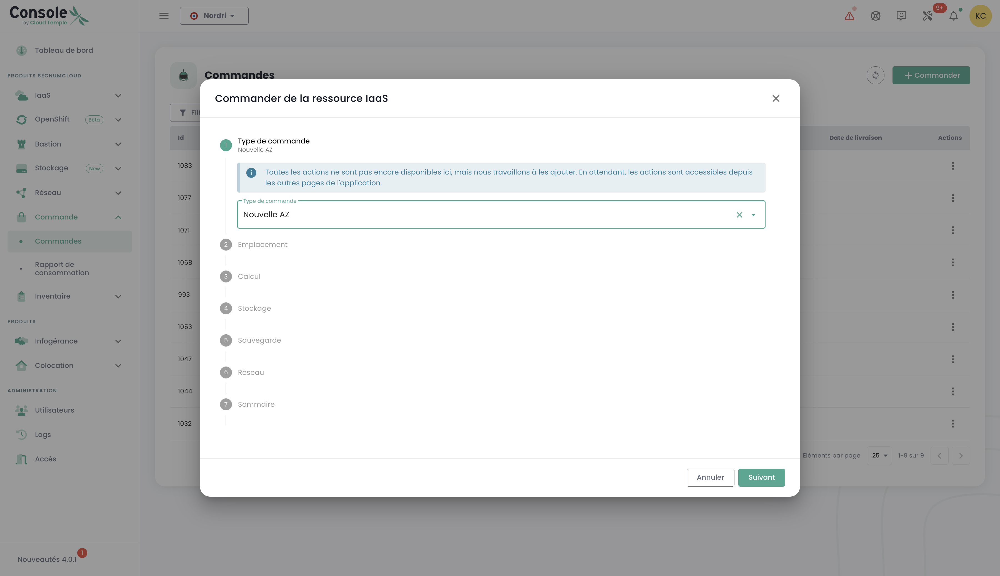
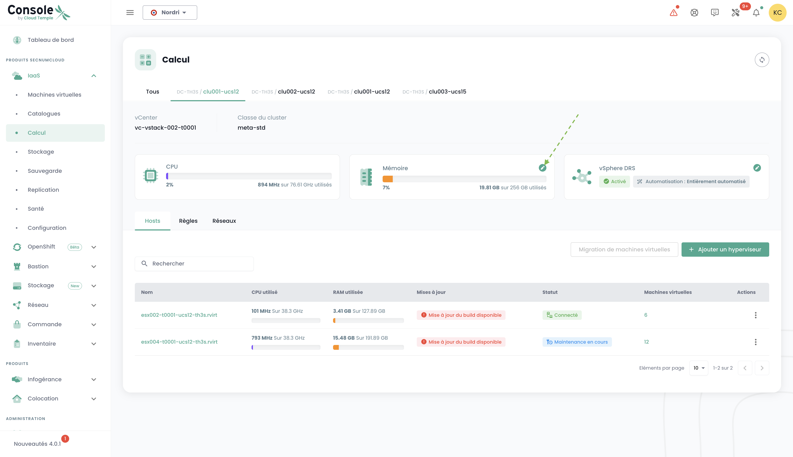

## Concept

Le suivi du déploiement de nouvelles ressources se fait dans le menu __'Commandes'__ accessible dans le bandeau vert à gauche de l'écran.

Il permet de visualizzare le risorse Cloud ordinate, in corso di implementazione e gli eventuali errori all'interno di un [Tenant](iam/concepts.md#tenant) della tua [Organizzazione](iam/concepts.md#organisations).

*__Nota : In questo momento, la visione globale a livello di un'organizzazione di tutte le risorse distribuite nei diversi tenant non è ancora possibile.__ Questo argomento verrà trattato nel 2024 con l'implementazione di un portale dedicato ai committenti (nel senso di firmatari) e alla gestione della loro organizzazione.*

Il deploiement des ressources ou leur suppression se font dans chacun des produits dans les menus __'IaaS'__ et __'Réseau'__ à gauche de l'écran dans le bandeau vert.

È anche possibile vedere direttamente le consegne a livello delle notifiche della console Cloud Temple:

Dalla pagina degli ordini, puoi vedere lo stato di avanzamento di una consegna ed eventualmente dialogare con il team fornendo commenti o precisazioni:

**Nota** : **Non è possibile avviare più ordini dello stesso tipo di risorsa contemporaneamente. È quindi necessario attendere che l'ordine in corso venga elaborato e completato prima di poterne effettuare uno nuovo. Ciò garantisce una gestione efficiente e ordinata delle risorse all'interno del vostro ambiente.**

## Ordinare una nuova zona di disponibilità

È possibile aggiungere una nuova zona di disponibilità accedendo al menu "**Ordine**". Questa opzione consente di espandere le proprie risorse e migliorare la disponibilità e la resilienza delle proprie applicazioni con pochi clic:

Per iniziare, selezionare la posizione desiderata, scegliendo prima la regione geografica, quindi la zona di disponibilità (AZ) corrispondente tra quelle disponibili. Questo passaggio consente di adattare il deployment delle risorse in base alla localizzazione e alle esigenze della propria infrastruttura:

Successivamente, procedere con la selezione del tipo di cluster di hypervisor desiderato, scegliendo quello che meglio risponde alle esigenze di prestazioni e gestione della propria infrastruttura cloud:

Successivamente, selezionare il numero di hypervisor e la quantità di memoria desiderata, in modo da adattare le risorse al carico di lavoro e alle esigenze specifiche del proprio ambiente cloud:

Selezionare quindi il numero di datastores da fornire nel cluster, nonché i loro tipi. È importante notare che il numero massimo di datastores consentito è 10, con un minimo di 2 datastores richiesti. Ogni tipo di datastore diverso comporterà la creazione di un datastoreCluster aggiuntivo. Ad esempio, se si scelgono 2 datastores di tipo "live" e 1 datastore di tipo "mass", ciò comporterà la formazione di 2 datastoreClusters distinti:

Definire la dimensione dello storage necessario per il backup, prevedendo una capacità equivalente a quella dello storage di produzione. Considerare un tasso di compressione medio di 2 per ottimizzare lo spazio di backup e garantire una protezione efficace dei dati:

Selezionare le reti da propagare in base alle proprie esigenze. È anche possibile attivare l'opzione "Accesso internet" se necessario, definendo il numero di indirizzi IP desiderati, con una scelta compresa tra 1 e un massimo di 8:

Si otterrà quindi un riepilogo delle opzioni selezionate prima di convalidare l'ordine.

## Ordinare risorse di storage aggiuntive

La logica di allocazione dello storage a blocchi sui cluster di calcolo è TODO

### Distribuire un nuovo cluster di calcolo

Procedere con l'ordine di un cluster di hypervisor selezionando le opzioni adatte alle proprie esigenze di virtualizzazione. Definire le caratteristiche chiave come il numero di hypervisor, il tipo di cluster, la quantità di memoria e le risorse di calcolo richieste:

Selezionare la zona di disponibilità:

Scegliere il tipo di blade di calcolo:

È quindi possibile selezionare reti già esistenti e propagarle, oppure crearne di nuove direttamente in questa fase, a seconda delle esigenze della propria infrastruttura. Si noti che il numero totale di reti configurabili è limitato a un massimo di 20:

Si otterrà quindi un riepilogo delle opzioni selezionate prima di convalidare l'ordine e si potrà quindi visualizzare l'ordine in corso:

### Distribuire un nuovo cluster di storage

Nel menu "**ordine**", procedere con l'ordine di un **nuovo cluster di storage** per il proprio ambiente selezionando le opzioni che corrispondono alle proprie esigenze in termini di capacità, prestazioni e ridondanza. Selezionare la posizione:

Definire il numero di datastores da fornire nel cluster, nonché il loro tipo, rispettando i seguenti limiti: un minimo di 2 datastores e un massimo di 10 possono essere configurati. Scegliere i tipi di datastores che rispondono meglio alle proprie esigenze in termini di prestazioni, capacità e utilizzo, per ottimizzare lo storage dell'ambiente:

Selezionare il tipo di storage desiderato tra le varie opzioni disponibili:

Si accede quindi a un riepilogo completo delle opzioni selezionate, che consente di verificare tutti i parametri prima di convalidare definitivamente l'ordine:

### Distribuire un nuovo datastore in un cluster SDRS VMware

In questo esempio, aggiungeremo storage a blocchi per un'infrastruttura VMware.
Per aggiungere un datastore aggiuntivo nel proprio cluster di storage SDRS, andare nel sottomenu __'Infrastruttura'__ quindi __'VMWare'__. 
Scegliere quindi la stack vmware e la zona di disponibilità. Successivamente, andare nel sottomenu __'Storage'__.

Scegliere il cluster SDRS corrispondente alle caratteristiche di prestazione desiderate e fare clic sul pulsante __'Aggiungi un datastore'__ che si trova nella tabella 
con l'elenco dei datastores.

__nota__ :  
- *La dimensione della più piccola LUN attivabile su un cluster è di __500 Gio__.*  
- *Le prestazioni di un datastore vanno da 500 iops/Tio in media fino a 15000 iops/Tio in media. __Questo è un limite software realizzato a livello dei controller di storage__.*  
- *Il calcolo del volume del disco consumato dall'organizzazione è la somma di tutte le LUNs sull'intero delle AZs utilizzate*.  
- *I diritti __'ordine'__ così come __'calcolo'__ sono necessari per il conto per eseguire questa azione.*

### Ordinare nuove reti

La tecnologia di rete utilizzata sull'infrastruttura Cloud Temple si basa su [VPLS](https://fr.wikipedia.org/wiki/Virtual_Private_LAN_Service). Consente di beneficiare di __reti di livello 2 in continuità tra le proprie zone di disponibilità all'interno di una regione__. 
È anche possibile condividere reti tra i propri tenant e terminarle in una zona di hosting.
Fondamentalmente, si può immaginare una rete Cloud Temple come una vlan 802.1q disponibile in qualsiasi punto del proprio tenant.

TODO

L'ordine di una nuova rete e le decisioni di condivisione tra i propri tenant, vengono effettuati nel menu __'Rete'__ del bandeau verde a sinistra dello schermo. Le reti saranno prima create, quindi verrà generato un ordine distinto per propagarle. È possibile seguire l'avanzamento degli ordini in corso accedendo alla scheda "Ordine" nel menu, oppure facendo clic sulle etichette informative che indirizzano agli ordini attivi o in corso di elaborazione.

È anche possibile propagare reti già esistenti o separare le due fasi, iniziando con la creazione della rete, quindi procedendo alla propagazione successivamente in base alle proprie esigenze. L'opzione di propagazione si trova nelle opzioni della rete selezionata:

Fare clic sull'opzione "Propagare" per una rete già esistente, quindi selezionare il target di propagazione desiderato. Questo passaggio consente di definire la posizione o le risorse sulle quali la rete deve essere propagata:

### Disattivazione di una rete

Una rete può anche essere disattivata se necessario. Questa opzione consente di sospendere temporaneamente l'accesso o l'utilizzo della rete senza eliminarla definitivamente, offrendo così flessibilità nella gestione della propria infrastruttura in base alle proprie esigenze.

L'opzione di disattivazione si trova nelle opzioni della rete selezionata.

## Aggiungere hypervisors aggiuntivi a un cluster di calcolo

La logica di funzionamento dei cluster di calcolo è TODO

L'aggiunta di hypervisors a un cluster di calcolo viene eseguita nel menu __'IaaS'__ nel bandeau verde a sinistra dello schermo.
Nell'esempio seguente, aggiungeremo calcolo su un cluster di hypervisor utilizzando la tecnologia VMware.

Allez dans le sous menu __'Infrastructure'__ puis __'VMWare'__. Choisissez alors la stack vmware et la zone de disponibilité et le cluster de calcul.
Dans cet exemple, il s'agit du __'clu001-ucs12'__. Cliquez sur le bouton __'Ajouter un host'__ qui se situe dans le tableau avec la liste des hosts, en haut à droite.

__nota__ : 

- *__La configuration d'un cluster doit être homogène__. Ainsi, il n'est pas permis de mixer les types d'hyperviseur au sein d'un cluster. Toutes les lames doivent être de même type.*
- *Les droits __'order'__ ainsi que __'compute'__ sont nécessaires au compte pour mener cette action.*

## Aggiungere risorse di memoria supplementare a un cluster di calcolo

La logica di allocazione della memoria sui cluster di calcolo è TODO

Per aggiungere memoria RAM a un cluster, basta andare sulla configurazione del cluster (come per l'aggiunta di un host di calcolo come visto in precedenza) e cliccare su __'Modifier la mémoire'__.

__nota__ :  
- *__Le macchine sono consegnate con la totalità della memoria fisica__. Lo sblocco della risorsa memoria è solo un'attivazione software a livello di un cluster.*  
- *Non è possibile modificare la quantità di memoria fisica di un tipo di lama. Tenere ben presente la capacità massima di una lama durante la creazione di un cluster.*  
- *I diritti __'order'__ e __'compute'__ sono necessari all'account per eseguire questa azione.*