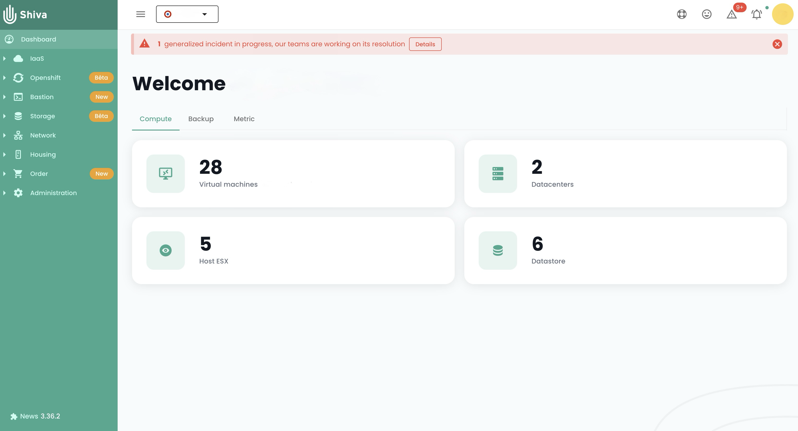

Come ogni piattaforma di infrastruttura Cloud, la piattaforma Cloud Temple è soggetta a lavori e manutenzione hardware e software regolarmente.

## Accesso alle operazioni e agli incidenti in corso

L'icona di monitoraggio delle operazioni permette di visualizzare le operazioni pianificate sull'infrastruttura Cloud Temple così come gli incidenti aperti sul tenant. Questa icona è accessibile nella barra delle icone in alto a sinistra dello schermo e ha la forma di un'icona __'Strumenti'__

Questa icona mira a fornire una visibilità sugli interventi pianificati, in corso e terminati e/o gli incidenti sul tenant.

Quando sono in corso interventi e/o incidenti, un numero appare sull'icona.

Cliccando su visualizzazione rapida, troverete gli interventi in corso. È anche possibile cliccare su __‘Tutti gli interventi’__ o __‘Tutti gli incidenti e rapporti del tenant’__ per visualizzare maggiori dettagli.

## Monitoraggio degli interventi pianificati

La pagina Interventi è composta da due schede. La prima scheda permette di visualizzare gli interventi previsti nei prossimi 30 giorni e gli interventi in corso.

Gli interventi terminati sono visibili nella seconda scheda 'Terminato'

L'accesso a queste informazioni richiede per il profilo dell'utente il permesso '**intervention_read**'.

## Gestione degli incidenti

Due tipi di incidenti sono da distinguere: incidenti globali, che influenzano l'intero sistema, e incidenti specifici ad un perimetro cliente, che impattano solo le risorse o i servizi associati ad un particolare cliente.

### Incidenti globali

Il recupero delle informazioni sugli incidenti globali non richiede alcun permesso particolare. Un banner rosso appare al momento della connessione alla console per avvisare della presenza di un incidente globale in corso di risoluzione. L'utente ha la possibilità di nascondere temporaneamente questo banner durante la sua sessione, ma riapparirà ad ogni nuova connessione o durante un aggiornamento della pagina, finché l'incidente resta irrisolto.

Un pulsante __'Scopri di più'__ reindirizza alla pagina pubblica di monitoraggio degli incidenti, permettendo di accedere a informazioni supplementari sull'incidente in corso:

È possibile ottenere i rapporti degli incidenti globali. L'accesso a questi rapporti richiede il permesso specifico '**incident_management**'.

Ecco un esempio della scheda che mostra questi rapporti:

### Incidenti su un perimetro sostenitore

La visibilità degli incidenti specifici ad un perimetro cliente richiede il permesso **incident_read**. Questi incidenti sono rappresentati da un'icona dedicata, accompagnata da un badge rosso che indica il numero di incidenti in corso.

L'icona è cliccabile, permettendo di elencare i ticket associati agli incidenti. Ogni ticket include un link ai dettagli dell'incidente, offrendo la possibilità di monitorare l'avanzamento della loro risoluzione:

Per consultare i dettagli di un incidente, è necessario essere l'autore del ticket dell'incidente o avere il permesso **support_management**.

### Gestione delle notifiche

Con l'obiettivo di informare rapidamente gli utenti in caso di un nuovo incidente, è stato messo in atto un sistema di notifiche via e-mail. Dal proprio profilo utente, una scheda intitolata '*I miei abbonamenti*' permette agli utenti di sottoscrivere notifiche per entrambi i tipi di incidenti. Così, riceveranno un'e-mail in un tempo molto breve durante la dichiarazione o la risoluzione di un incidente.

L'oggetto dell'e-mail indicherà il tipo di incidente e, nel caso di un incidente legato a un perimetro, il nome del perimetro impattato. La notifica conterrà anche un link che permette di accedere direttamente ai dettagli dell'incidente:

