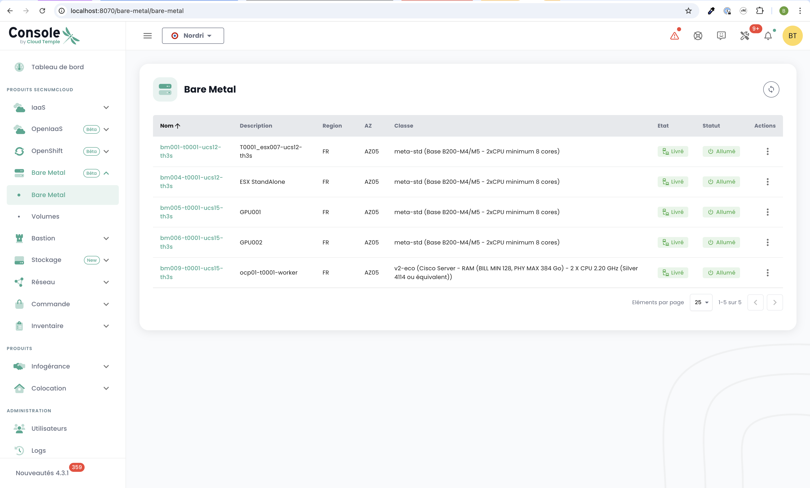
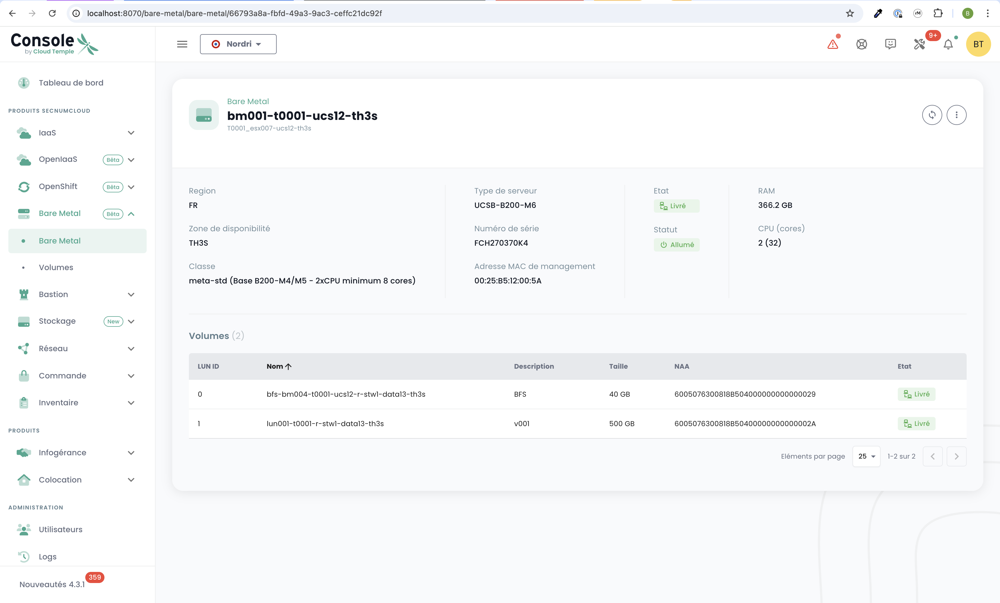
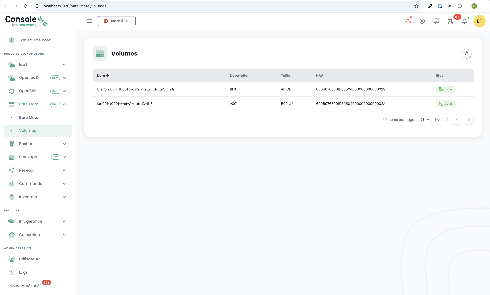

# QuickStart per l'offerta Bare Metal

Questa pagina ti guida attraverso i passaggi iniziali per utilizzare l'offerta **Bare Metal** dalla console Cloud Temple. Segui queste istruzioni per scoprire i menu e le funzionalità disponibili.

---

## Prerequisiti
Prima di iniziare, assicurati dei seguenti punti:
1. **Sottoscrizione attivata**: La tua organizzazione deve aver sottoscritto l'offerta Bare Metal.
2. **Permessi utente**: Il tuo account utente deve disporre dei diritti necessari per accedere e gestire le risorse Bare Metal.

---

## Accesso all'interfaccia Bare Metal

Una volta che la sottoscrizione è stata attivata e i permessi configurati, apparirà un nuovo menu intitolato **Bare Metal** nella console Cloud Temple. Questo menu contiene due sottomenu principali: **Bare Metal** e **Volumes**.

---

### 1. Sottomenu **Bare Metal**

Il sottomenu **Bare Metal** ti presenta una tabella che elenca tutte le istanze Bare Metal disponibili. Questa tabella include le informazioni principali per ciascuna istanza:
- **Nome del Bare Metal**
- **Stato**
- **Configurazione hardware**
- **Indirizzo IP**

#### Funzionalità principali
- **Pulsante Azione**: Permette di accedere direttamente alla console di amministrazione del Bare Metal.
- **Nome cliccabile**: Cliccando sul nome di un'istanza Bare Metal, si apre una nuova pagina con i **dettagli completi** dell'istanza:
  - Informazioni sull'hardware (RAM, CPU, GPU, ecc.).
  - Configurazione di rete (indirizzi IP associati).
  - Informazioni di connettività per la gestione.

---

### 2. Sottomenu **Volumes**

Il sottomenu **Volumes** visualizza una tabella che elenca tutti i volumi di archiviazione associati alla tua sottoscrizione Bare Metal. Per ciascun volume, sono disponibili le seguenti informazioni:
- **Nome del volume**
- **Capacità**
- **Classe di performance** (IOPS per TB)
- **Stato** (Disponibile, In fase di distribuzione, ecc.)

#### Funzionalità principali
- Gestione dei volumi: Da questa tabella, è possibile mappare i volumi alle tue istanze Bare Metal.

---