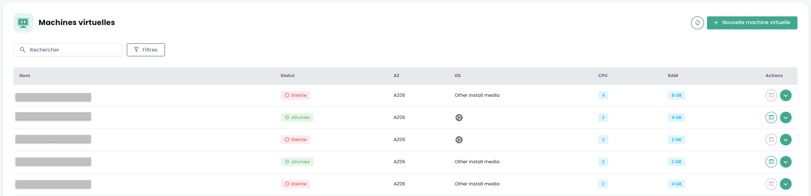
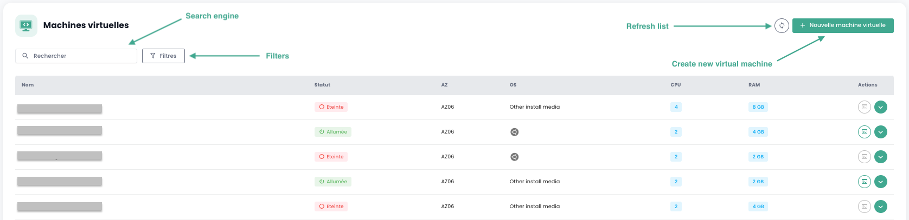
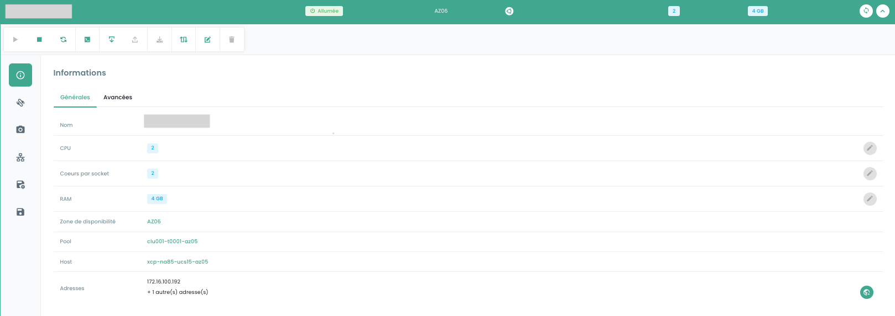
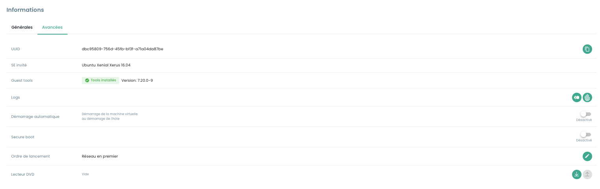

## Calcolo

### Gestione delle Macchine virtuali

L'interfaccia di gestione delle tue macchine virtuali è disponibile nella console Shiva nel menu __'OpenIaaS'__ situato sulla barra verde a sinistra dello schermo.

### Elenco delle macchine virtuali

Nella sezione __'Macchine virtuali'__, hai accesso all'elenco delle tue macchine virtuali ospitate sul tuo Cloud di fiducia.

Hai accesso alle seguenti informazioni per ciascuna macchina virtuale:

- Il suo nome.
- Il suo stato (spenta, accesa).
- La sua zona di disponibilità (AZ).
- Il suo sistema operativo.
- La quantità di CPU virtuali (vCPU).
- La quantità di memoria virtuale (vRAM).

### Azioni sulle macchine virtuali

Le seguenti azioni sono possibili da questa interfaccia:

- Aggiornare l'elenco delle macchine virtuali.
- Filtrare l'elenco.
- Cercare una macchina virtuale per nome.
- Creare una nuova macchina virtuale.

Quando fai clic sulla freccia a discesa verde a destra dell'elenco per una macchina virtuale, puoi accedere a tutte le informazioni relative ad essa.

Un banner rapido consente di eseguire le seguenti azioni:

- Accendere la macchina virtuale.
- Spegnerla.
- Riavviarla.
- Aprire la console.
- Montare un ISO.
- Smontare un ISO.
- Convertire la macchina virtuale in template.
- Spostarla.
- Rinominare.
- Eliminare.

Nella scheda di informazioni '**Generali**', trovi informazioni dettagliate relative alla tua macchina virtuale, come la sua posizione fisica (AZ, Pool, Host), la RAM, la CPU, gli indirizzi IP e altro.

Una scheda '**Avanzate**' consente di visualizzare informazioni più specifiche:

- UUID della macchina virtuale
- Guest tools
- OS guest
- Lettore DVD

E di modificare alcune opzioni come:
- L'ordine di avvio
- Il secure boot
- L'avvio automatico (impossibile se non è associata alcuna politica di backup alla VM)

