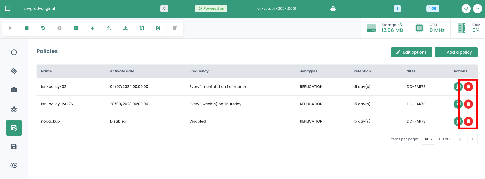

## Calcolo

### Gestione delle Macchine Virtuali

L'interfaccia di gestione delle vostre macchine virtuali è disponibile nella console Shiva nel menu __'IaaS'__ situato sulla banda verde a sinistra dello schermo.

### Elenco delle macchine virtuali

Nella sezione __'Macchine virtuali'__, avete accesso all'elenco delle vostre macchine virtuali ospitate sul vostro Cloud di fiducia.

Avete accesso alle seguenti informazioni, per ogni macchina virtuale:

- il suo nome,
- i tag che le sono assegnati,
- il suo stato (spenta, accesa, in elaborazione, host disconnesso o non valido),
- il suo manager (in ambiente VMware, il Vcenter associato),
- il suo sistema operativo,
- La quantità di CPU virtuali (vCPU),
- La quantità di memoria virtuale (vRAM).

### Azioni sulle macchine virtuali

Le seguenti azioni sono possibili da questa interfaccia:

- Aggiornare l'elenco delle macchine virtuali;
- Esportare l'elenco in formato CSV;
- Filtrare l'elenco;
- Cercare una macchina virtuale per nome;
- Creare una nuova macchina virtuale.

__In alto nell'elenco può essere presente una banda di avvisi__ : indica che sono state attivate allarmi critici su una o più delle vostre macchine virtuali.
Il pulsante __'Vedi'__ consente di consultare le macchine virtuali interessate da questa notifica.

Quando cliccate sulla freccia a tendina verde a destra dell'elenco per una macchina virtuale:

Accedete a tutte le informazioni riguardanti la macchina:

Una banda rapida consente di eseguire le seguenti azioni:

- Accendere la macchina virtuale;
- Spegnerla;
- Riavviarla;
- Modificare le opzioni di alimentazione del SO ospite;
- Aprire la console;
- Montare un ISO;
- Smontare un ISO;
- Clonare la macchina virtuale;
- Spostarla (vMotion);
- Rinominare la macchina;
- Eliminarla.

Una vista rapida offre una visualizzazione dello __storage__, della __CPU__ e della __RAM__ della macchina virtuale.

Nella scheda __'Informazioni generali'__, trovate informazioni dettagliate relative alla vostra macchina virtuale, come il suo OS, la sua posizione fisica (datacenter, datastore, ecc.), la RAM, la CPU, gli indirizzi IP, i log e altro.

Da questa vista, potete eseguire le seguenti azioni:

- Modificare il sistema operativo (la macchina virtuale deve essere spenta),
- Aggiornare la versione dell'hardware (la macchina virtuale deve essere spenta),
- Modificare la RAM o la CPU.

Una scheda __'Avanzato'__ permette di consultare informazioni più specifiche come le info "VMware tools", la versione hardware, il manager, ecc...

### Modifica del controller del disco di una macchina virtuale

Potete modificare il tipo di controller del disco per la vostra macchina virtuale. I tipi supportati sono __SCSI__ e __NVME__. Potete aggiungere controller con un massimo di 4 controller per ciascun tipo.

### Console di una macchina virtuale

La console di una macchina virtuale è accessibile dall'elenco delle macchine virtuali cliccando sull'icona __'Console'__:

Una nuova scheda del vostro browser si apre e mostra la console della vostra macchina, basata su un client VNC:

È possibile nel menu VNC:

- richiedere l'invio di tasti particolari,
- eseguire copia/incolla dagli appunti del vostro SO,
- passare alla modalità a schermo intero,
- cambiare la dimensione della finestra (scaling).

La gestione della tastiera, con la console delle macchine virtuali, funziona perfettamente in un ambiente interamente *inglese*.

L'immissione effettuata nella console dipende dalla lingua della tastiera della vostra macchina fisica, dalla lingua della tastiera della macchina virtuale e dall'attivazione o meno dell'opzione 'enforce keyboard' a sinistra dello schermo.
Ecco una sintesi delle possibili situazioni con la lingua francese:

| Lingua della tastiera della macchina fisica (input) | Lingua della tastiera della macchina virtuale | Opzione 'enforce keyboard' selezionata | Risultato (output)                                |
| ---------------------------------------------------- | ---------------------------------------------- | -------------------------------------- | --------------------------------------------------- |
| Francese                                            | Francese                                      | No                                     | Sconsigliato (problemi con caratteri speciali)      |
| Francese                                            | Francese                                      | Sì                                     | < e > non funzionano                               |
| Francese                                            | Inglese                                       | No                                     | Sconsigliato (problemi con caratteri speciali)      |
| Francese                                            | Inglese                                       | Sì                                     | Inglese                                            |
| Inglese                                             | Francese                                      | No                                     | < e > non funzionano                               |
| Inglese                                             | Francese                                      | Sì                                     | < e > non funzionano                               |
| Inglese                                             | Inglese                                       | No                                     | Inglese                                            |
| Inglese                                             | Inglese                                       | Sì                                     | Inglese                                            |

__Nota__:

- Se la combinazione __'AltGr'__ e __'@'__ sulla tastiera non funziona, attivate il pulsante __'enforce key'__ nel menu __'VNC'__ della console e riprovate.
- Se non funziona ancora e il SO della macchina fisica è __Windows, mettete la tastiera della macchina fisica in inglese e provate a inserire il @ in modo classico__ *(output azerty: AltGr + tasto 0 o output qwerty: tasto 2)*.

### Cataloghi delle macchine virtuali Cloud Temple

Cloud Temple mette a vostra disposizione un catalogo di `Templates` regolarmente arricchito e aggiornato dai nostri team.
Comprende a oggi diverse decine di `Templates` e immagini da montare sulle vostre macchine virtuali.

### Configurazione avanzata delle macchine virtuali: Extra Config

Le Extra Config forniscono un modo flessibile per includere coppie chiave=valore nella configurazione di una macchina virtuale. Le chiavi e i valori vengono interpretati dal sistema quando la macchina virtuale viene distribuita.

Ora, potete modificare le proprietà di tipo __Extra Config__ nelle opzioni avanzate di una macchina virtuale:

Potete aggiungere una proprietà da un elenco di chiavi. Inoltre, potete modificare il valore di una chiave che avete aggiunto voi stessi. Le coppie chiave=valore già esistenti non sono modificabili.

Per qualsiasi richiesta di aggiunta di nuove chiavi, contattare l'assistenza.

__Nota__ : *Per l'utilizzo di GPU da parte della macchina virtuale, è obbligatorio attivare la chiave 'pciPassthru.use64bitMMIO' e allocare la quantità di spazio MMIO (Memory-mapped I/O) necessaria tramite 'pciPassthru.64bitMMIOSizeGB'. È fortemente consigliato fare riferimento alla [documentazione ufficiale Nvidia](https://docs.nvidia.com/vgpu/17.0/grid-vgpu-release-notes-vmware-vsphere/index.html#tesla-p40-large-memory-vms).*

### Configurazione avanzata delle macchine virtuali: vAPP

Potete, inoltre, modificare le proprietà di tipo __vAPP__ nelle opzioni avanzate di una macchina virtuale:

Potete aggiungere una proprietà, modificarla o eliminarla. Sono proposti quattro tipi di proprietà: Stringa, Numero, Booleano, Password:

__Nota__ : *La macchina virtuale deve essere spenta per modificare le sue proprietà vAPP.*

### Gestione degli __'hypervisors'__ e __'Cpool'__ (clusters di hypervisors)

La gestione dei vostri hypervisors si effettua nel sottomenu __'Calcolo'__ del menu __'IaaS'__, situato sulla banda verde a sinistra del vostro schermo.

In questo sottomenu, disponete di una vista su:

- Lo stack software di hypervisors, il loro AZ e le loro risorse,
- Lo stack software di backup.

A gennaio 2024, l'offerta di hypervisor disponibile sull'infrastruttura qualificata Cloud Temple è basata su VMware. Il software di backup utilizzato è IBM Spectrum Protect Plus.

### Gestione dei clusters VMware

Per accedere alla gestione dei clusters VMware, cliccate nel sottomenu __'Calcolo'__ del menu __'IaaS'__:

Di default, la prima scheda elenca tutti gli hypervisors (tutti i clusters):

È possibile visualizzare i dettagli di un hypervisor cliccando sul suo nome:

Esiste una scheda per ciascun cluster di hypervisors per consultare i dettagli di ognuno:

Se cliccate su un cluster, visualizzate la sintesi della sua composizione:

- Il totale della potenza di calcolo espressa in Ghz,
- Il totale della memoria disponibile e il rapporto utilizzato,

- Il totale dello spazio di archiviazione (tutti i tipi) così come la quota parte utilizzata,
- I meccanismi di automazione in caso di indisponibilità di una lama di calcolo (__'Vsphere DRS'__),
- Il numero di macchine virtuali,
- Il numero di hypervisor.

<!-- TODO: Add missing page. -->
<!-- Consultando la pagina di un cluster, diverse schede sono disponibili. La scheda __'Regole'__ consente di definire le [regole di affinità / anti-affinità](compute.md#gestion-de-laffinité-de-vos-machines-virtuelles) -->

Vedete apparire per ogni hypervisor nella scheda __'Hosts'__ :

- L'uso di __CPU__ e __Memoria__,
- Il numero di macchine virtuali assegnate,
- La disponibilità di una nuova build per il sistema operativo dell'hypervisor, se del caso,
- Lo stato dell'hypervisor (connesso in produzione, in manutenzione, spento, ...),
- Un menu Azione.

Diverse azioni sono possibili dalla scheda __'Hosts'__:

- ordinare nuovi hypervisor tramite il pulsante __'Aggiungi un host'__:

- possibilità di consultare __il dettaglio di un hypervisor__:

- di entrare o uscire dallo stato di __manutenzione__ di un hypervisor,
- di __aggiornare__ quest'hypervisor se necessario; per fare ciò, __deve essere assolutamente in manutenzione__. Esistono due tipi di aggiornamenti:

1. Le build VMware (le nuove versioni dell'hypervisor):

2. L'aggiornamento del firmware della vostra lama di calcolo (bios e firmware schede figlio):

*__Nota__* :

- *Cloud Temple rende disponibili le build per gli hypervisor a intervalli regolari.
È importante aggiornare regolarmente i vostri hypervisor, in particolare per consentire l'applicazione delle patch di sicurezza.
Tuttavia, __non aggiorniamo noi stessi i vostri hypervisor__. Cloud Temple non ha visibilità sugli impegni di disponibilità dei vostri carichi di lavoro.
Lasciamo quindi a voi implementare la vostra gestione del cambiamento e applicare le nuove build al momento migliore.*
- *Il processo di aggiornamento è completamente automatizzato. Dovete disporre di almeno due hypervisor nel vostro cluster per consentire un aggiornamento senza interruzione del servizio.*

<!-- TODO: Add missing page. -->
<!-- - *È necessario avere [le autorizzazioni appropriate](../console/permissions.md) per eseguire le diverse azioni.* -->

Vedete anche tutte le regole di affinità/anti-affinità per il vostro cluster di hypervisor nella parte __'Regole'__.

### Gestione dell'affinità delle vostre macchine virtuali

Le __regole di affinità e anti-affinità__ permettono di controllare la posizione delle macchine virtuali sui vostri hypervisor.
Possono essere utilizzate per gestire l'uso delle risorse del vostro __'Cpool'__.
Ad esempio, possono aiutare a bilanciare il carico di lavoro tra i server o a isolare i carichi di lavoro ad alto consumo di risorse.
In un __'Cpool'__ VMware, queste regole sono spesso utilizzate per gestire il comportamento delle macchine virtuali con vMotion.
vMotion consente di spostare le macchine virtuali da un host a un altro senza interruzione del servizio.

Potete configurare grazie alla gestione delle regole:

- __Regole di Affinità__: Queste regole assicurano che certe macchine virtuali siano eseguite sullo stesso host fisico.
Sono utilizzate per migliorare le prestazioni mantenendo le macchine virtuali che comunicano frequentemente
insieme sullo stesso server per ridurre la latenza di rete. Le regole di affinità sono utili in scenari
dove la performance è critica, come nel caso di database o applicazioni che richiedono una comunicazione rapida tra i server.

- __Regole di Anti-affinità__: Al contrario, queste regole garantiscono che certe macchine virtuali non siano eseguite
sullo stesso host fisico. Sono importanti per la disponibilità e la resilienza, ad esempio,
per evitare che macchine critiche siano tutte colpite in caso di guasto di un singolo server.
Le regole di anti-affinità sono cruciali per le applicazioni che richiedono alta disponibilità,
come negli ambienti di produzione dove la tolleranza ai guasti è una priorità.
Ad esempio, non desiderate che i vostri due Active Directory siano sullo stesso hypervisor.

Durante la creazione di una regola, definite il tipo di regola (affinità / anti-affinità), il nome della regola,
il suo stato di attivazione (__'Stato'__) e le macchine interessate del vostro cluster di hypervisor.

*Nota: le regole di affinità/anti-affinità proposte nella console sono regole riguardanti le macchine virtuali tra loro (non ci sono regole tra hypervisor e macchine virtuali).*

## Backup

### Creare una politica di backup

Per aggiungere una nuova politica di backup, è necessario fare una richiesta al supporto. Il supporto è accessibile dall'icona di salvagente in alto a destra della finestra.

La creazione di una nuova politica di backup è realizzata tramite __una richiesta di servizio__ indicando:

    Il nome della vostra Organizzazione
    Il nome di un contatto con il suo email e numero di telefono per finalizzare la configurazione
    Il nome del tenant
    Il nome della politica di backup
    Le caratteristiche (x giorni, y settimane, z mesi, ...)

### Assegnare una politica di backup a una macchina virtuale

Quando una SLA è assegnata a una macchina virtuale (VM), tutti i dischi associati a questa VM ereditano automaticamente la stessa SLA. Successivamente, è possibile lanciare manualmente l'esecuzione del backup tramite la scheda "Politiche di backup". In mancanza di un avvio manuale, il backup verrà eseguito automaticamente secondo la pianificazione configurata dalla SLA.

SecNumCloud rende obbligatoria l'assegnazione di una politica di backup a una macchina virtuale prima del suo avvio. In caso contrario, riceverete la seguente notifica:

Cliccate sulla scheda __'Politiche di backup'__ del menu della vostra macchina virtuale. Potete visualizzare le politiche di backup assegnate alla VM.

Per assegnare una nuova politica di backup alla macchina virtuale, cliccate sul pulsante __'Aggiungi una politica'__ e selezionate la politica di backup desiderata.

### Assegnare una politica di backup a un disco virtuale

È anche possibile assegnare una SLA direttamente a un disco virtuale specifico di una macchina. In questo caso, la macchina virtuale non eredita questa SLA applicata individualmente al disco. Tuttavia, non è possibile lanciare manualmente l'esecuzione del backup a livello dei dischi, poiché questa funzionalità non è supportata in Spectrum Protect Plus.

Invece, è possibile escludere determinati dischi da una o più politiche di backup (SLA) della VM, il che consente di disassegnare una o più SLA su base disco per disco. Questo approccio offre la flessibilità di lanciare manualmente l'esecuzione del backup di una SLA senza influenzare tutti i dischi della macchina virtuale, consentendo una gestione più fine dei backup.

Cliccate sulla barra delle azioni del disco a cui desiderate assegnare una politica di backup. Poi, cliccate su __'Politiche'__ e selezionate la politica di backup desiderata.

*Nota*: La politica da aggiungere deve trovarsi in una zona di disponibilità diversa da quella della macchina virtuale.

### Eseguire una politica di backup

Nel menu __'Politiche di backup'__ della vostra macchina virtuale, cliccate sul pulsante __'Esegui'__ nella colonna __'Azioni'__ della politica di backup che desiderate eseguire.

Per eseguire una politica di backup, potete anche andare alla sezione __'Backup'__ nel menu della vostra macchina virtuale. Cliccate sul pulsante __'Esegui il backup'__, poi selezionate il backup che desiderate eseguire nel menu a tendina.

### Rimuovere una politica di backup

Nel menu __'Politiche di backup'__ della vostra macchina virtuale, cliccate sul pulsante __'Rimuovi'__ nella colonna __'Azioni'__ della politica di backup che desiderate rimuovere.

__Attenzione, non è possibile rimuovere l'ultima SLA su una macchina virtuale accesa:__

### Eliminazione di una politica di backup: caso di una politica di backup sospesa ("held")

Quando l'ultima risorsa è dissociata da una politica SLA, il sistema rileva automaticamente questa situazione. Di conseguenza, tutti i lavori legati a questa politica SLA passano automaticamente allo stato "Sospeso" ("Held"). È importante notare che a questo punto la cancellazione diretta della politica SLA non è possibile a causa dell'esistenza di lavori dipendenti. Per procedere con la cancellazione della politica, deve essere seguito un certo numero di passaggi.

Bisogna verificare che i lavori interessati siano effettivamente nello stato "Sospeso". Una volta effettuata questa verifica, tali lavori possono essere eliminati. Solo dopo aver cancellato questi lavori dipendenti, la politica SLA potrà essere definitivamente eliminata dal sistema.
Un cas particulier mérite une attention spécifique : l'ajout d'une nouvelle ressource à une politique SLA dont les travaux dépendants n'ont pas été supprimés. Dans cette situation, les identifiants des travaux seront conservés. Cependant, il est crucial de noter que les travaux en état "Suspendu" ne reprendront pas automatiquement. Une intervention manuelle sera nécessaire pour les réactiver et permettre leur exécution.

nota: Per qualsiasi precisazione su questa situazione, contattare il supporto Cloud Temple.

La console Cloud Temple impedisce l'assegnazione di una macchina virtuale a una politica sospesa:

Allo stesso modo, non è possibile avviare una macchina virtuale associata a una politica di backup sospesa:

### Ripristinare un backup

La scheda __'Backup'__ del menu delle vostre macchine virtuali consente di accedere all'elenco dei backup delle stesse.
Per ripristinare un backup, cliccare sul pulsante __'Ripristina'__ sulla linea corrispondente al backup che si desidera ripristinare.

1. __Modalità produzione__ : La modalità produzione consente il ripristino dopo un incidente sul sito locale dal storage primaria o da un sito di ripristino remoto, sostituendo le immagini della macchina originale con immagini di ripristino. Tutte le configurazioni vengono trasferite durante il ripristino, inclusi nomi e identificatori, e tutti i lavori di copia dei dati associati alla macchina virtuale continuano a essere eseguiti. Nel contesto di un ripristino in modalità produzione, è possibile scegliere di sostituire lo storage nella macchina virtuale con un disco virtuale proveniente da un backup precedente della macchina virtuale.

2. __Modalità test__ : La modalità test crea macchine virtuali temporanee per lo sviluppo, i test, la verifica degli snapshot e la verifica del ripristino dopo un incidente secondo un planning ripetibile, senza impatto sugli ambienti di produzione. Le macchine di test funzionano per tutto il tempo necessario al test e alla verifica, quindi vengono eliminate. Tramite il networking isolato, è possibile stabilire un ambiente sicuro per testare i propri lavori senza interferire con le macchine virtuali utilizzate per la produzione. Le macchine virtuali create in modalità test hanno nomi e identificatori unici per evitare conflitti nel vostro ambiente di produzione.

3. __Modalità clone__ : La modalità clone crea copie delle macchine virtuali per i casi d'uso che richiedono copie permanenti o a lungo termine per l'esplorazione dei dati o la duplicazione di un ambiente di test su una rete isolata. Le macchine virtuali create in modalità clone hanno nomi e identificatori unici per evitare conflitti nel vostro ambiente di produzione. In modalità clone, è necessario prestare attenzione al consumo di risorse poiché la modalità clone crea macchine permanenti o a lungo termine.

__Il ripristino è di default in modalità "TEST" per preservare la produzione__ ed è possibile scegliere il nome della vm ripristinata:

Si noti che, se i test sono soddisfacenti, è possibile passare una macchina virtuale dalla modalità test alla modalità produzione:

