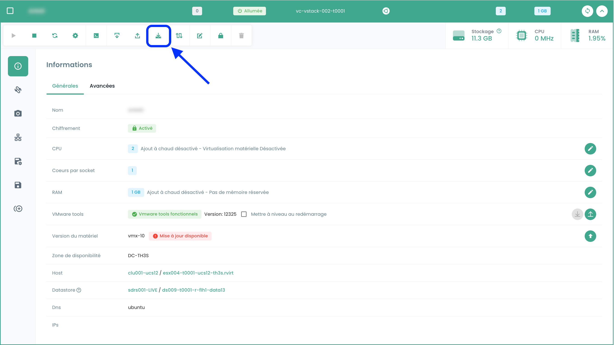
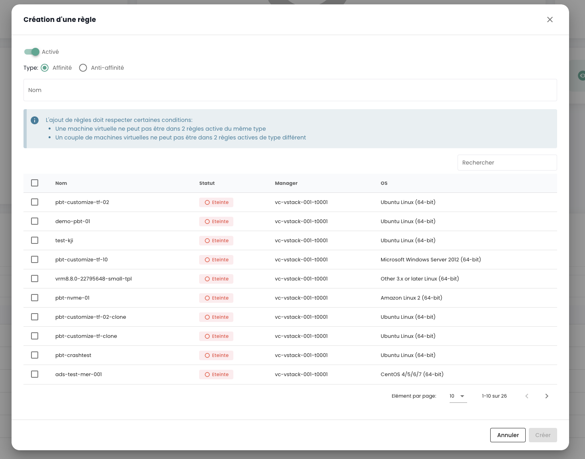

## Calcolo

### Gestione delle Macchine Virtuali

L'interfaccia di gestione delle vostre macchine virtuali è disponibile nella console Shiva nel menu __'IaaS'__ situato nella banda verde a sinistra dello schermo.

### Elenco delle macchine virtuali

Nella sezione __'Macchine virtuali'__, avrete accesso all'elenco delle vostre macchine virtuali ospitate nel vostro Cloud di fiducia.


Avrete accesso alle seguenti informazioni per ciascuna macchina virtuale:
- il suo nome,
- i tag assegnati,
- il suo stato (spenta, accesa, in elaborazione, host disconnesso o invalido),
- il suo gestore (in un ambiente VMware, il Vcenter associato),
- il suo sistema operativo,
- La quantità di CPU virtuali (vCPU),
- La quantità di memoria virtuale (vRAM).

### Azioni sulle macchine virtuali

Le seguenti azioni sono possibili da questa interfaccia:

- Aggiornare l'elenco delle macchine virtuali;
- Esportare l'elenco nel formato CSV;
- Filtrare l'elenco;
- Cercare una macchina virtuale per nome;
- Creare una nuova macchina virtuale.


__Una barra di allerta può essere presente in alto nell'elenco__ : indica che sono stati attivati allarmi critici su una o più delle vostre macchine virtuali.
Il pulsante __'Vedere'__ consente di visualizzare le macchine virtuali interessate da questa notifica.


Quando cliccate sulla freccia a discesa verde a destra dell'elenco per una macchina virtuale:


Accedete a tutte le informazioni riguardanti quella macchina:


Una barra rapida consente di eseguire le seguenti azioni:


- Accendere la macchina virtuale;
- Spegnerla;
- Riavviarla;
- Modificare le opzioni di alimentazione del SO guest;
- Aprire la console;
- Montare un ISO;
- Smontare un ISO;
- Clonare la macchina virtuale;
- Spostarla (vMotion);
- Rinominarla;
- Eliminarla.

Una vista rapida offre una visualizzazione dello __storage__, della __CPU__ e della __RAM__ della macchina virtuale.


Nella scheda __'Informazioni generali'__, trovate informazioni dettagliate relative alla vostra macchina virtuale, come il suo sistema operativo, la sua ubicazione fisica (datacenter, datastore, ecc.), la RAM, la CPU, gli indirizzi IP, i log e altro.


Da questa vista, potete eseguire le seguenti azioni:

- Modificare il sistema operativo (la macchina virtuale deve essere spenta),
- Aggiornare la versione dell'hardware (la macchina virtuale deve essere spenta),
- Modificare la RAM o la CPU.

Una scheda __'Avanzato'__ consente di visualizzare informazioni più specifiche come le info "VMware tools", la versione hardware, il gestore, ecc.


### Modifica della RAM o della CPU di una macchina virtuale
Andate nella scheda __'Macchine Virtuali'__, visualizzate i dettagli di una macchina virtuale,
selezionate la scheda __'Informazioni generali'__ e cliccate sul pulsante di modifica della variabile da modificare:


### I tipi di dischi

Potete aggiungere diversi tipi di dischi:
  - __Persistente__ : Le modifiche vengono immediatamente e definitivamente scritte sul disco virtuale. **Questo è il tipo consigliato.**
  - __Indipendente non-persistente__ : Le modifiche apportate al disco virtuale sono registrate in un nuovo log e eliminate allo spegnimento. Non è influenzato dagli snapshot. **Non è supportato dal backup.**
  - __Indipendente persistente__ : Le modifiche vengono immediatamente e definitivamente scritte sul disco virtuale. Non è influenzato dagli snapshot. **Non è supportato dal backup.**

### Gestione dei controller delle macchine virtuali

Potete modificare il tipo di controller del disco per la vostra macchina virtuale.


Le macchine virtuali possono essere dotate di controller SCSI e NVME, con un limite di 4 controller per ciascun tipo. Ogni controller può gestire fino a 15 dischi.

Un controller SCSI può essere configurato con diversi sottotipi: Para Virtual, Bus Logic, LSI Logic o LSI Logic SAS.

Il controller Para Virtual si distingue per la sua capacità estesa. Può supportare fino a 64 dischi quando la versione hardware della macchina virtuale è compatibile con un ESXi versione 6.7 o superiore.

> **Importante** : Se desiderate modificare il tipo di un controller Para Virtual che possiede più di 15 dischi, dovrete prima scollegare i dischi dagli slot interessati.

### Console di una macchina virtuale

La console di una macchina virtuale è accessibile dall'elenco delle macchine virtuali cliccando sull'icona __'Console'__:


Si aprirà una nuova scheda del vostro browser che mostrerà la console della vostra macchina, basata su un client VNC:


È possibile, nel menu VNC:

- richiedere l'invio di un tasto particolare,
- copiare/incollare dal blocco note del vostro sistema operativo,
- passare alla modalità a schermo intero,
- cambiare la dimensione della finestra (scaling).

La gestione della tastiera, con la console delle macchine virtuali, funziona perfettamente in un ambiente completamente *inglese*.

L'inserimento effettuato nella console dipende dalla lingua della tastiera della vostra macchina fisica, dalla lingua della tastiera della macchina virtuale e dall'attivazione o meno dell'opzione 'enforce keyboard' a sinistra dello schermo.
Ecco una sintesi delle possibili situazioni con la lingua francese:

| Lingua della tastiera della macchina fisica (input) | Lingua della tastiera della macchina virtuale | Opzione 'enforce keyboard' selezionata | Risultato (output)                                   |
| --------------------------------------------------- | ---------------------------------------------- | -------------------------------------- | -------------------------------------------------- |
| Francese                                            | Francese                                      | No                                     | Sconsigliato (problemi con i caratteri speciali)    |
| Francese                                            | Francese                                      | Sì                                     | < e > non funzionano                              |
| Francese                                            | Inglese                                       | No                                     | Sconsigliato (problemi con i caratteri speciali)    |
| Francese                                            | Inglese                                       | Sì                                     | Inglese                                             |
| Inglese                                             | Francese                                      | No                                     | < e > non funzionano                              |
| Inglese                                             | Francese                                      | Sì                                     | < e > non funzionano                              |
| Inglese                                             | Inglese                                       | No                                     | Inglese                                             |
| Inglese                                             | Inglese                                       | Sì                                     | Inglese                                             |

__Nota__ :

- Se la combinazione __'AltGr'__ e __'@'__ sulla tastiera non funziona, attivate il pulsante __'enforce key'__ nel menu __'VNC'__ della console e riprovate.
- Se non funziona ancora e il sistema operativo della macchina fisica è __Windows, impostate la tastiera della macchina fisica in inglese e provate a inserire il @ in modo classico__ *(output azerty : AltGr + tasto 0 o output qwerty : tasto 2)*.

### Cataloghi di macchine virtuali Cloud Temple

Cloud Temple mette a vostra disposizione un catalogo di `Templates` regolarmente arricchito e aggiornato dai nostri team.
Ad oggi comprende diverse decine di `Templates` e immagini da montare sulle vostre macchine virtuali.


Per pubblicare un ISO/OVF, andate nella vista __'Catalogo'__ e cliccate sul pulsante __'pubblicare file'__ in alto nella pagina:


È possibile trasformare una VM in un modello ed esportarla nel catalogo. Per farlo, selezionate una macchina virtuale e utilizzate il pulsante di azione __'clona'__:



Selezionate __'Esporta in vm-template'__:


Inserite poi le informazioni necessarie. Sarà quindi possibile distribuire una nuova VM dal modello utilizzando il pulsante __'Nuova macchina virtuale'__ o dalla pagina __'Cataloghi'__. È inoltre possibile esportare la VM in formato OVF.

**Da sapere**: è possibile convertire un file OVA in OVF e viceversa.
Il metodo più comune utilizzato è VMware convertor, ma esiste anche un metodo semplice utilizzando ```tar```.

Estrazione del file ova:
```
$ tar -xvf vmName.ova
```

Creare un file OVA da un file OVF:
```
$ tar -cvf vmName-NEW.ova vmName.ovf vmName-disk1.vmdk vmName.mf
```

### Configurazione avanzata delle macchine virtuali: Extra Config

Le Extra Config forniscono un modo flessibile per includere coppie chiave=valore nella configurazione di una macchina virtuale. Le chiavi e i valori vengono interpretati dal sistema quando la macchina virtuale viene distribuita.

Ora, potete modificare voi stessi le proprietà di tipo __Extra Config__ nelle opzioni avanzate di una macchina virtuale:


Potete aggiungere una proprietà da un elenco di chiavi. Inoltre, potete modificare il valore di una chiave che avete aggiunto voi stessi. Le coppie chiave=valore già esistenti non sono modificabili.

Contattate il supporto per qualsiasi richiesta di aggiunta di nuove chiavi.


__Nota__ : *Per l'utilizzo della GPU da parte della macchina virtuale, è obbligatorio attivare la chiave 'pciPassthru.use64bitMMIO' e allocare la quantità di spazio MMIO (Memory-mapped I/O) necessaria tramite 'pciPassthru.64bitMMIOSizeGB'. Si consiglia vivamente di fare riferimento alla [documentazione ufficiale Nvidia](https://docs.nvidia.com/vgpu/17.0/grid-vgpu-release-notes-vmware-vsphere/index.html#tesla-p40-large-memory-vms).*

### Configurazione avanzata delle macchine virtuali: vAPP

Potete anche modificare le proprietà di tipo __vAPP__ nelle opzioni avanzate di una macchina virtuale:


Potete aggiungere una proprietà, modificarla o eliminarla. Sono proposti quattro tipi di proprietà: Stringa, Numero, Booleano, Password:


__Nota__ : *La macchina virtuale deve essere fermata per modificare le sue proprietà vAPP.*

### Gestione degli __'hypervisor'__ e __'Cpool'__ (cluster di hypervisor)

La gestione dei vostri hypervisor si effettua nel sottomenu __'Calcolo'__ del menu __'IaaS'__, situato nella banda verde a sinistra del vostro schermo.


In questo sottomenu, avete una vista su:

- Lo stack software degli hypervisor, le loro AZ e le loro risorse,
- Lo stack software di backup.

A gennaio 2024, l'offerta di hypervisor disponibile sull'infrastruttura qualificata Cloud Temple è basata su VMware. Il software di backup utilizzato è IBM Spectrum Protect Plus.

### Gestione dei cluster VMware

Per accedere alla gestione dei cluster VMware, cliccate nel sottomenu __'Calcolo'__ del menu __'IaaS'__:

Per impostazione predefinita, la prima scheda elenca tutti gli hypervisor (tutti i cluster combinati):


È possibile visualizzare i dettagli di un hypervisor cliccando sul suo nome:


Esiste una scheda per ogni cluster di hypervisor per consultare i dettagli di ciascuno:


Se cliccate su un cluster, vedrete la sintesi della sua composizione:

- Il totale della potenza di calcolo espresso in Ghz,
- Il totale della memoria disponibile e il rapporto utilizzato,
- Il totale dello spazio di archiviazione (tutti i tipi combinati) e la quota parte utilizzata,
- I meccanismi di automazione in caso di indisponibilità di una lama di calcolo (__'Vsphere DRS'__),
- Il numero di macchine virtuali,
- Il numero di hypervisor.

<!-- TODO: Add missing page. -->
<!-- Consultando la pagina di un cluster, sono disponibili diverse schede. La scheda __'Regole'__ vi permette di definire le [regole di affinità / anti-affinità](compute.md#gestione-dell-affinita-delle-vostre-macchine-virtuali) -->


Nella scheda __'Hosts'__ vedrete apparire per ogni hypervisor:

- L'utilizzo di __CPU__ e __Memoria__,
- Il numero di macchine virtuali assegnate,
- La disponibilità di una nuova build per il sistema operativo dell'hypervisor, se applicabile,
- Lo stato dell'hypervisor (connesso in produzione, in manutenzione, spento, ...),
- Un menu di azioni.


Diverse azioni sono possibili dalla scheda __'Hosts'__:

- ordinare nuovi hypervisor tramite il pulsante __'Aggiungi un host'__:


- possibilità di consultare __i dettagli di un hypervisor__:


- entrare o uscire dallo __stato di manutenzione__ di un hypervisor,
- __aggiornare__ l'hypervisor se necessario; per fare ciò, __deve essere obbligatoriamente in manutenzione__. Esistono due tipi di aggiornamenti:

1. Le build VMware (le nuove versioni dell'hypervisor):


2. L'aggiornamento del firmware della vostra lama di calcolo (bios e firmware delle schede figlie):


*__Nota__* :

- *Cloud Temple mette a disposizione le build per gli hypervisor a intervalli regolari.
È importante aggiornare regolarmente i vostri hypervisor, in particolare per consentire l'applicazione delle patch di sicurezza.
Tuttavia, __non aggiorniamo i vostri hypervisor da soli__. Cloud Temple non ha visibilità sugli impegni di disponibilità dei vostri workload.
Vi lasciamo quindi implementare la vostra gestione del cambiamento e applicare le nuove build al momento migliore.*
- *Il processo di aggiornamento è completamente automatizzato. Devi avere almeno due hypervisors nel tuo cluster per permettere un aggiornamento senza interruzione del servizio.*

<!-- TODO: Add missing page. -->
<!-- - *È necessario avere [le autorizzazioni adeguate](../console/permissions.md) per effettuare le diverse azioni.* -->

Vedi anche tutte le regole di affinità/anti-affinità per il tuo cluster di hypervisors nella sezione __'Regole'__.

### Gestione dell'affinità delle tue macchine virtuali

Le __regole di affinità e anti-affinità__ permettono di controllare la posizione delle macchine virtuali sui tuoi hypervisors.
Possono essere utilizzate per gestire l'uso delle risorse del tuo __'Cpool'__.
Ad esempio, possono aiutare a bilanciare il carico di lavoro tra i server o a isolare i carichi di lavoro intensivi di risorse.
In un __'Cpool'__ VMware, queste regole sono spesso utilizzate per gestire il comportamento delle macchine virtuali con vMotion.
vMotion permette di spostare macchine virtuali da un host a un altro senza interruzione del servizio.

Puoi configurare grazie alla gestione delle regole:

- __Regole di Affinità__ : Queste regole assicurano che alcune macchine virtuali vengano eseguite sullo stesso host fisico.
Sono utilizzate per migliorare le prestazioni mantenendo le macchine virtuali che comunicano frequentemente
insieme sullo stesso server per ridurre la latenza di rete. Le regole d'affinità sono utili in scenari
dove la performance è critica, come nel caso di database o applicazioni che richiedono una comunicazione rapida tra i server.

- __Regole di Anti-affinità__ : Al contrario, queste regole assicurano che alcune macchine virtuali non vengano eseguite
sullo stesso host fisico. Sono importanti per la disponibilità e la resilienza, ad esempio,
per evitare che macchine critiche siano tutte coinvolte in caso di guasto di un singolo server.
Le regole d'anti-affinità sono cruciali per le applicazioni che necessitano di alta disponibilità,
come negli ambienti di produzione dove la tolleranza ai guasti è una priorità.
Ad esempio, non desideri che i tuoi due Active Directory siano sullo stesso hypervisor.

Durante la creazione di una regola, definisci il tipo di regola (affinità / anti-affinità), il nome della regola,
il suo stato di attivazione (__'Stato'__) e le macchine interessate del tuo cluster di hypervisors.



*Nota: le regole di affinità/anti-affinità proposte nella console sono regole che riguardano le macchine virtuali tra loro (nessuna regola tra hypervisors e macchine virtuali).*

## Backup

### Creazione di una politica di backup

Per aggiungere una nuova politica di backup, è necessario fare una richiesta al supporto. Il supporto è accessibile dall'icona della ciambella in alto a destra della finestra.

La creazione di una nuova politica di backup viene effettuata tramite __una richiesta di servizio__ indicando:

    Il nome della tua Organizzazione
    Il nome di un contatto con la sua email e n° di telefono per finalizzare la configurazione
    Il nome del tenant
    Il nome della politica di backup
    Le caratteristiche (x giorni, y settimane, z mesi, ...)


### Assegnare una politica di backup a una macchina virtuale

Quando una SLA è assegnata a una macchina virtuale (VM), tutti i dischi associati a questa VM ereditano automaticamente la stessa SLA. Successivamente, è possibile avviare manualmente l'esecuzione del backup tramite la scheda "Politiche di backup". In mancanza di un avvio manuale, il backup verrà eseguito automaticamente secondo il piano configurato dalla SLA.

SecNumCloud rende obbligatoria l'assegnazione di una politica di backup a una macchina virtuale prima del suo avvio. In caso contrario, riceverai la seguente notifica:


Clicca sulla scheda __'Politiche di backup'__ del menu della tua macchina virtuale. Puoi visualizzare lì le politiche di backup assegnate a essa.

Per assegnare una nuova politica di backup alla macchina virtuale, clicca sul pulsante __'Aggiungi una politica'__ e seleziona la politica di backup desiderata.


### Assegnare una politica di backup a un disco virtuale

È anche possibile assegnare una SLA direttamente a un disco virtuale specifico di una macchina. In questo caso, la macchina virtuale non eredita questa SLA applicata individualmente al disco. Tuttavia, non è possibile avviare manualmente l'esecuzione del backup a livello dei dischi, poiché questa funzionalità non è supportata in Spectrum Protect Plus.

Invece, è possibile escludere alcuni dischi da una o più politiche di backup (SLA) della VM, il che consente di deassegnare una o più SLA su base disco per disco. Questo approccio offre la flessibilità di avviare manualmente l'esecuzione del backup di una SLA senza influire su tutti i dischi della macchina virtuale, permettendo così una gestione più fine dei backup.

Clicca sulla barra delle azioni del disco a cui desideri assegnare una politica di backup. Poi, clicca su __'Politiche'__ e seleziona la politica di backup desiderata.


*Nota* : La politica da aggiungere deve trovarsi su una zona di disponibilità diversa dalla macchina virtuale.

### Eseguire una politica di backup

Nel menu __'Politiche di backup'__ della tua macchina virtuale, clicca sul pulsante __'Eseguire'__ della colonna __'Azioni'__ della politica di backup che desideri eseguire.


Per eseguire una politica di backup, puoi anche partire dalla sezione __'Backup'__ nel menu della tua macchina virtuale. Clicca sul pulsante __'Esegui il backup'__, poi seleziona il backup che desideri eseguire nella lista a discesa.


### Rimuovere una politica di backup

Nel menu __'Politiche di backup'__ della tua macchina virtuale, clicca sul pulsante __'Rimuovere'__ della colonna __'Azioni'__ della politica di backup che desideri rimuovere.


__Attenzione, non è possibile rimuovere l'ultima SLA su una macchina virtuale accesa :__


### Eliminazione di una politica di backup: caso di una politica di backup sospesa ("held")

Quando l'ultima risorsa è dissociata da una politica SLA, il sistema rileva automaticamente questa situazione. Di conseguenza, tutti i lavori legati a questa politica SLA passano automaticamente allo stato di "Sospeso" ("Held"). È importante notare che a questo punto l'eliminazione diretta della politica SLA non è possibile a causa dell'esistenza di lavori dipendenti. Per procedere all'eliminazione della politica, deve essere seguito una serie di passaggi.

È necessario verificare che i lavori interessati siano effettivamente nello stato "Sospeso". Una volta effettuata questa verifica, tali lavori possono essere eliminati. Solo dopo aver eliminato questi lavori dipendenti la politica SLA potrà essere definitivamente cancellata dal sistema.

Un caso particolare merita un'attenzione specifica: l'aggiunta di una nuova risorsa a una politica SLA i cui lavori dipendenti non sono stati eliminati. In questa situazione, gli identificativi dei lavori verranno mantenuti. Tuttavia, è cruciale notare che i lavori nello stato "Sospeso" non riprenderanno automaticamente. Sarà necessario un intervento manuale per riattivarli e consentire la loro esecuzione.

nota : Per qualsiasi chiarimento su questa situazione, contatta il supporto Cloud Temple.

La console Cloud Temple impedisce l'assegnazione di una macchina virtuale a una politica sospesa:


Allo stesso modo, non è possibile avviare una macchina virtuale associata a una politica di backup sospesa:


### Ripristinare un backup

La scheda __'Backup'__ del menu delle tue macchine virtuali ti consente di accedere all'elenco dei backup di quest'ultima.
Per ripristinare un backup, clicca sul pulsante __'Ripristinare'__ sulla riga corrispondente al backup che desideri ripristinare.


1. __Modalità produzione__ : La modalità produzione consente il ripristino dopo incidenti sul sito locale dal storage primario o da un sito di ripristino remoti, sostituendo le immagini originali della macchina con le immagini di recupero. Tutte le configurazioni vengono trasferite durante il ripristino, inclusi i nomi e gli identificatori, e tutti i lavori di copia dei dati associati alla macchina virtuale continuano a essere eseguiti. Nel contesto di un ripristino in modalità produzione, puoi scegliere di sostituire lo storage nella macchina virtuale con un disco virtuale proveniente da un backup di macchina virtuale precedente.

2. __Modalità test__ : La modalità test crea macchine virtuali temporanee per lo sviluppo, il test, la verifica degli snapshot e la verifica del ripristino in caso di incidente in conformità con una pianificazione ricorrente, senza impatto sugli ambienti di produzione. Le macchine di test funzionano per tutto il tempo necessario per eseguire il test e la verifica, dopodiché vengono eliminate. Attraverso il networking isolato, puoi creare un ambiente sicuro per testare i tuoi lavori senza interferire con le macchine virtuali utilizzate per la produzione. Le macchine virtuali create in modalità test hanno nomi e identificatori unici per evitare conflitti nel tuo ambiente di produzione.

3. __Modalità clone__ : La modalità Clone crea copie delle macchine virtuali per i casi d'uso che richiedono copie permanenti o di lunga durata per l'esplorazione dei dati o la duplicazione di un ambiente di test su una rete isolata. Le macchine virtuali create in modalità clone hanno nomi e identificatori unici per evitare conflitti nel tuo ambiente di produzione. In modalità clone, devi prestare attenzione al consumo delle risorse poiché la modalità clone crea macchine permanenti o a lungo termine.

__Il ripristino è di default in modalità "TEST" per preservare la produzione__ e puoi scegliere il nome della vm ripristinata:


Nota che se i test sono soddisfacenti, è possibile spostare una macchina virtuale dalla modalità test alla modalità produzione:


