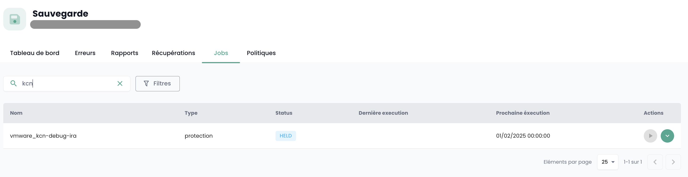

## Come clonare una macchina virtuale?

Esistono 2 modi per clonare una macchina virtuale:

- La prima opzione consente di clonare una macchina virtuale direttamente dall'icona __'Clone'__ della tua macchina virtuale:

- La seconda soluzione consiste nel clonare la macchina virtuale utilizzando __un backup__ della macchina virtuale e poi usando __il ripristino in modalità clone__ da un backup.
Vai alla parte __'Backup'__ della tua macchina virtuale e scegli l'azione __'Ripristina'__:

Quindi, scegli l'opzione __'Clone'__ di ripristino:

## Perché quando accedo alla pagina "politiche di backup" e seleziono una politica, non vedo le stesse macchine virtuali che vedo quando accedo a "rapporti di backup" e seleziono la stessa politica?

Ciò significa che le macchine virtuali mancanti hanno avuto la politica in questione assegnata loro per un certo periodo (spiegando la loro presenza nei rapporti di backup) ma che __non è più il caso attualmente__.

## Come aggiungere una politica di backup a una macchina virtuale?

Vai alla pagina __'Macchine Virtuali'__ nella sezione __'IaaS'__ del menu verde a sinistra dello schermo.

Seleziona una macchina virtuale, poi la scheda __'Politiche di backup'__ di tale macchina:

Aggiungi la politica di backup desiderata:

## Come rimuovere una politica di backup da una macchina virtuale?

Vai alla pagina __'Macchine Virtuali'__, seleziona una macchina virtuale, poi la scheda __'Politiche di backup'__ di tale macchina.

Rimuovi la politica di backup desiderata e conferma la rimozione:

__*Nota:*__ *Attenzione! __Secnumcloud impone che ci sia almeno una politica di backup__ per ogni macchina virtuale.*

## Come sapere se un backup è stato eseguito correttamente?

Ci sono 2 soluzioni possibili:

1. Vai alla pagina __'Jobs'__ del menu __'Backup'__ nel menu verde a sinistra dello schermo. Scegli il job corrispondente al backup e selezionalo.
Quindi, trova la *jobsession* corrispondente al tuo backup, selezionalo tramite il menu __'Azioni'__.

Queste azioni consentono di visualizzare i log dettagliati dell'esecuzione del backup. Puoi cercare nei registri di backup:

2. Vai alla pagina __'Rapporti di backup'__ e seleziona la politica che ti interessa:

Puoi quindi filtrare per data, scaricare il rapporto in formato __PDF__ o __CSV__ per utilizzarlo in strumenti di terze parti.

## Come avviare un ripristino?

Vai alla pagina __'Macchine Virtuali'__, seleziona una macchina virtuale, poi la scheda __'Backup'__ di tale macchina. Per avviare il ripristino, seleziona il backup da ripristinare.

## Cos'è l'opzione di quiescing?

Il __quiescing__ è un processo che avvisa il sistema di mettersi in uno stato adatto prima dell'inizio dello snapshot.
Per impostazione predefinita, il __quiescing è abilitato__. Può essere disabilitato manualmente nel caso in cui il sistema non gestisca bene lo snapshot o se l'agente dell'hypervisor non è installato sulla macchina virtuale.

Per fare ciò, nella parte __'Backup'__ della tua macchina virtuale, clicca su __'Modifica le opzioni'__ e disabilita il __quiescing__:

## Quali sono le opzioni di ripristino di una macchina virtuale?

3 opzioni principali per ripristinare una vm, sulla sua destinazione iniziale o su una destinazione differente:

- __'CLONE'__: Ripristina la macchina virtuale rinominandola, senza sostituire la macchina virtuale originale.

- __'PRODUCTION'__: Ripristina e __sostituisce__ la macchina virtuale di produzione (la macchina virtuale attualmente in produzione è __distrutta__)

- __'TEST'__: Ripristina la macchina virtuale di produzione __senza sovrascriverla__.

Troverai più dettagli nella [documentazione sul backup](../../../iaas/backup.md).

## Come ripristinare e sostituire la macchina virtuale di produzione, senza mantenere la macchina virtuale attualmente in produzione?

Scegli la modalità di ripristino __'Production'__. L'opzione 'sovrascrivi la macchina virtuale' è predefinita.

## Perché il numero di macchine virtuali è diverso tra i moduli backup e compute?

La differenza di macchine virtuali può derivare dal fatto che il modulo di backup non ha recuperato le ultime macchine create.

Per aggiornare il modulo di backup, è necessario richiedere al livello software di backup di re-inventariare le macchine virtuali.
Per fare ciò, nel menu __'Infrastruttura'__ del menu verde a sinistra dello schermo, naviga verso il sottomenu __'Spectrum Protect Plus'__ e utilizza il pulsante __'Azione'__ dell'inventario:

Nota che è indicata la data dell'ultimo inventario.

Se persiste una differenza di macchine virtuali, potrebbe dipendere dalle macchine virtuali che ospitano il sistema che consente i backup. Infatti, queste ultime non si conteggiano da sole nel calcolo del numero di macchine sul modulo di backup.

## Come inventariare le macchine virtuali sul modulo backup?

Per avviare un inventario delle macchine virtuali sul modulo di backup, nel menu __'Infrastruttura'__ del menu verde a sinistra dello schermo, naviga verso il sottomenu __'Spectrum Protect Plus'__ e utilizza il pulsante __'Azione'__ dell'inventario:

Nota che è indicata la data dell'ultimo inventario.

## Perché il backup della mia macchina virtuale fallisce segnalando un problema di snapshot?

Questo errore significa che è la prima volta che la tua macchina tenta di essere backupata.

__Durante il primo backup di una macchina virtuale, non deve essere presente alcuno snapshot sulla macchina.__

## Come ripristinare e sostituire la macchina virtuale di produzione, mantenendo e rinominando la macchina virtuale di produzione?

Ecco come procedere:

- Scegli la modalità __'CLONE'__ (la modalità clone comporta un cambio di indirizzo MAC e UUID della macchina virtuale),
- Rinomina la macchina virtuale ripristinata con il nome definitivo (della vm di produzione),
- Rinomina la vecchia macchina virtuale di produzione (in _OLD).

## Come ripristinare una macchina virtuale, senza sostituire la macchina virtuale originale?

Ecco come procedere:

- Scegli la modalità __'CLONE'__ (la modalità clone comporta un cambio di indirizzo MAC e UUID della macchina virtuale)
- Definisci il nome del clone (_REST o altri)

## Perché non posso eliminare un disco in modalità instant access sulla mia macchina virtuale?

Esegui l'inventario del backup: nel menu __'Infrastruttura'__ del menu verde a sinistra dello schermo, naviga verso il sottomenu __'Spectrum Protect Plus'__ e utilizza il pulsante __'Azione'__ dell'inventario:

Esegui l'eliminazione del disco una volta terminato l'inventario. Aggiorna la macchina virtuale per verificare che il disco sia stato eliminato.

## Perché non posso avviare una macchina virtuale con una politica in stato Held (politica sospesa)?

Una politica in stato "Held" è una funzionalità che consente di sospendere temporaneamente le azioni di retention e cancellazione dei dati, garantendo così che i dati restino intatti e disponibili oltre il loro periodo di retention standard per specifiche ragioni come la conformità o le esigenze legali.

Supponiamo che un'azienda abbia una politica di retention di backup di 30 giorni per alcuni dati di produzione. A causa di un'indagine legale, ricevono una richiesta di preservare tutti i backup pertinenti per un periodo indeterminato. Hai la possibilità di sospendere la politica di backup associata tramite lo stato "Held" per impedire la cancellazione automatica di questi backup dopo 30 giorni, garantendo così che i dati restino disponibili per tutta la durata dell'indagine.

Una politica di backup sospesa (in stato Held) non eseguirà i backup del planning ad essa assegnato, quindi la macchina virtuale non può essere considerata protetta, il che non rispetta le norme SecNumCloud.

Non esitare a chiedere consiglio al nostro team di supporto su questo argomento.