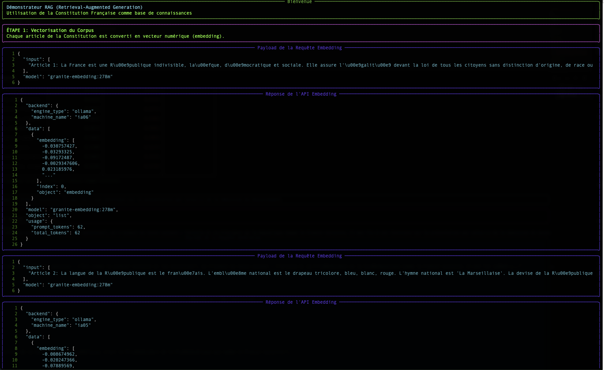
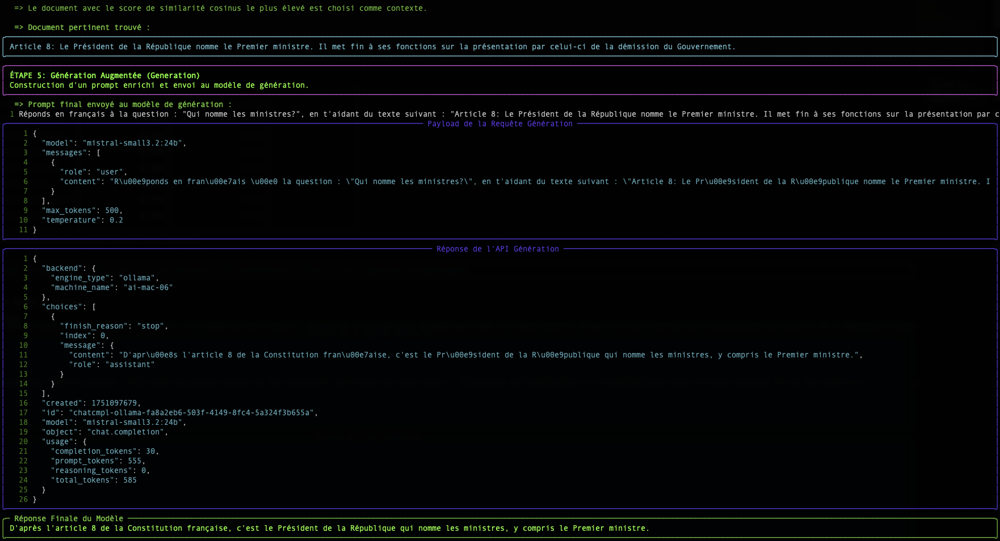

# Comprendere il RAG: L'Embedding e la Distanza Vettoriale

Lo script `simple-rag-demo` è un'ottima illustrazione del funzionamento di un sistema RAG (Retrieval-Augmented Generation). Questa pagina spiega i concetti fondamentali che lo fanno funzionare: l'**embedding** e la **ricerca per similarità**.

## Il problema: i LLM non hanno memoria a lungo termine

Un grande modello di linguaggio (LLM) come Mistral o Granite è molto potente, ma conosce solo i dati su cui è stato addestrato. Non conosce i vostri documenti interni, gli ultimi articoli di stampa o le specificità del vostro settore.

Il **RAG** è una tecnica che permette di fornire al LLM un "memoria esterna" fornendogli, al momento della domanda, gli estratti di documenti più rilevanti per aiutarlo a formulare la risposta.

Il processo si svolge in due fasi:
1.  **Retrieval (Recupero)** : Trovare i documenti giusti.
2.  **Augmented Generation (Generazione Amplificata)** : Utilizzare questi documenti per generare una risposta.

È il passo di "Retrieval" che ci interessa qui. Come può un computer "comprendere" che una domanda è semanticamente simile a un paragrafo? La risposta è: con i vettori.

## Passo 1: L'Embedding - Trasformare le Parole in Numeri

Un computer non comprende le parole, ma è eccellente nel manipolare i numeri. L'**embedding** è il processo che traduce un testo (una parola, una frase, un documento) in una lista di numeri, chiamata **vettore**.

`"Il gatto è sul tappeto."`  →  `[-0.01, 0.98, 0.45, ..., -0.33]`

Questo vettore non è casuale. Rappresenta la "posizione" del testo in uno spazio semantico multidimensionale. Testi con significati simili avranno vettori che puntano in direzioni simili.

**Analogia**: Immagina una mappa geografica. "Parigi" e "Francia" sarebbero molto vicine, così come "Roma" e "Italia". "Parigi" sarebbe più lontana da "Roma" rispetto a "Francia", ma più vicina rispetto a "Tokyo". L'embedding fa la stessa cosa, ma con migliaia di "dimensioni" invece di due, per catturare sfumature di significato complesse.

Nel nostro script, l'endpoint `/v1/embeddings` e il modello `granite-embedding:278m` sono responsabili di questa traduzione.

## Fase 2: La Ricerca - Misurare la Prossimità Semantica

Una volta che la nostra domanda e tutti i nostri documenti vengono trasformati in vettori, la ricerca diventa un problema matematico: **trovare il vettore del documento più "vicino" al vettore della domanda.**

Esistono diversi modi per misurare questa "prossimità". Il nostro script ne utilizza due: la Similarità Cosinus e la Distanza Euclidea.

### Similarità Cosinus (Lo Standard)

-   **Concetto** : Non misura la distanza, ma l'**angolo** tra due vettori. Un angolo piccolo (vicino a 0°) indica che i vettori puntano nella stessa direzione, quindi i testi hanno un significato molto simile.
-   **Punteggio** : Il coseno di un angolo di 0° è 1 (similarità perfetta). Il coseno di un angolo di 90° è 0 (nessuna similarità).
-   **Perché è così utilizzata?** Per il testo, la *direzione* semantica è molto più importante della *magnitudine* (la lunghezza) del vettore. La similarità cosinus ignora la magnitudine e si concentra esclusivamente sulla direzione.

**Esempio semplice in 2D :**
-   Domanda : `v_q = [2, 2]`
-   Doc A : `v_a = [4, 4]` (stesso significato, più lungo)
-   Doc B : `v_b = [-2, 2]` (direzione diversa)

Il calcolo della similarità cosinus darà :
-   `cos(v_q, v_a) = 1.0` → Angolo di 0°. Similarità perfetta.
-   `cos(v_q, v_b) = 0.0` → Angolo di 90°. Nessuna similarità.

Questo è il risultato che vogliamo: il Documento A è semanticamente identico alla domanda, anche se la formulazione è più lunga.

### La Distanza Euclidea (La Regola)

-   **Concetto** : È la distanza "a volo d'uccello" tra i punti terminali dei due vettori.
-   **Punteggio** : Un punteggio di 0 indica che i vettori sono identici. Più alto è il punteggio, più sono distanti.
-   **Svantaggio per il testo** : È sensibile alla grandezza. Nel nostro esempio sopra, la distanza tra `v_q` e `v_a` non sarebbe nulla, poiché i vettori non hanno la stessa lunghezza, anche se hanno lo stesso senso.

## Conclusione

La tabella mostrata dallo script `simple-rag-demo` ti permette di visualizzare queste due metriche. Noterete che, anche se i ranking possono talvolta differire leggermente, la **similarità coseno è generalmente la metrica scelta** per le applicazioni di ricerca semantica basate su testo.

La maggiore sfida, come mostra l'esempio, rimane la **qualità del modello di embedding**. Un buon modello produrrà vettori che catturano fedelmente il significato, rendendo il calcolo della vicinanza, qualunque sia il metodo, molto più affidabile.