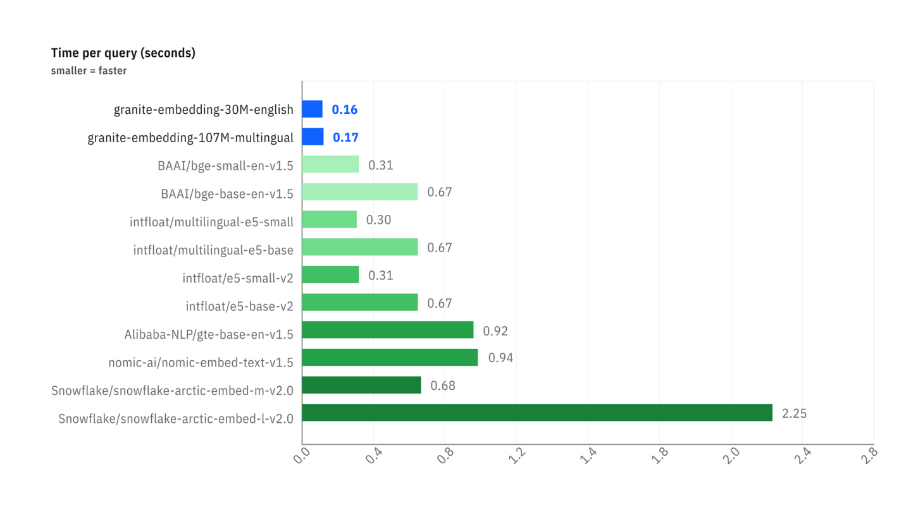

# Il RAG: Interrogare i tuoi Dati con un LLM

Questo documento spiega i concetti fondamentali dietro la tecnica di **Retrieval-Augmented Generation (RAG)**.

:::tip Codice di Esempio Disponibile
I concetti trattati qui vengono illustrati in un dimostratore completo e funzionante disponibile sul nostro GitHub. Costituisce una buona base di partenza per comprendere il funzionamento pratico di un pipeline RAG.

➡️ **[Accedi al codice del Simple RAG Demo](https://github.com/Cloud-Temple/product-llmaas-how-to/tree/main/simple_rag_demo)**
:::

## Il problema: i LLM non hanno una memoria a lungo termine

Un grande modello di linguaggio (LLM) come Mistral o Granite è molto potente, ma conosce solo i dati sui quali è stato addestrato. Non conosce i vostri documenti interni, gli ultimi articoli di stampa o le specificità del vostro settore.

Il **RAG** è una tecnica che permette di fornire al LLM un "memoria esterna" fornendogli, al momento della domanda, gli estratti dei documenti più rilevanti per aiutarlo a formulare la risposta.

Il processo si svolge in due fasi:
1. **Retrieval (Recupero)**: Trovare i documenti giusti.
2. **Augmented Generation (Generazione Amplificata)**: Utilizzare questi documenti per generare una risposta.

È questa fase di **Recupero** che è al centro del nostro argomento. Come fa un computer a "capire" che una domanda e un paragrafo parlano della stessa cosa? La magia avviene grazie ai **vettori**.

## Fase 1: L'Embedding: Trasformare le parole in numeri

Un computer non comprende le parole, ma è eccellente nel manipolare i numeri. L'**embedding** è il processo che traduce un testo (una parola, una frase, un documento) in una lista di numeri, detta **vettore**.

:::tip Cosa è un vettore?
In termini semplici, un vettore è una lista di numeri che rappresenta un punto in uno spazio a più dimensioni. Ogni numero nel vettore corrisponde a una coordinata su un "asse" di questo spazio. Per gli embeddings di testo, questi assi non sono `x`, `y`, `z` ma dimensioni semantiche astratte (ad esempio, un asse potrebbe rappresentare il concetto di "regalità", un altro quello di "gatto", ecc.).
:::

`"Il gatto è sul tappeto."`  →  `[-0.01, 0.98, 0.45, ..., -0.33]`

Questo vettore non è casuale. Rappresenta la "posizione" del testo in uno spazio semantico multidimensionale. Testi con significati simili avranno vettori che puntano in direzioni simili.

:::tip Analogia geografica
Immagina una mappa geografica. "Parigi" e "Francia" sarebbero molto vicine, così come "Roma" e "Italia". "Parigi" sarebbe più lontana da "Roma" rispetto a "Francia", ma più vicina rispetto a "Tokyo". L'embedding fa la stessa cosa, ma con migliaia di "dimensioni" invece di due, per catturare sfumature di significato complesse.
:::

Nel nostro script, l'endpoint `/v1/embeddings` e il modello `granite-embedding:278m` sono responsabili di questa traduzione.

### Focus sui Modelli Granite Embedding

Gli embedding fanno parte integrante dell'ecosistema LLM. Un modo preciso ed efficiente per rappresentare parole, query e documenti in forma numerica è essenziale per una serie di compiti aziendali, tra cui la ricerca semantica, la ricerca vettoriale e la RAG, nonché per mantenere basi di dati vettoriali efficienti. Un modello di embedding efficace può notevolmente migliorare la comprensione dell'intenzione dell'utente da parte del sistema e aumentare la rilevanza delle informazioni e delle fonti nella risposta a una query.

Mentre negli ultimi due anni si è verificata una proliferazione di LLM open source autoregressivi sempre più competitivi per compiti come la generazione e la sintesi del testo, i modelli di embedding open source pubblicati dai principali fornitori sono relativamente rari.

#### Perché Granite Embedding?

I nuovi modelli **Granite Embedding** di IBM, che mettiamo a disposizione, rappresentano un'evoluzione migliorata della famiglia di modelli di linguaggio a encoder unico basati su RoBERTa, denominata Slate. Si distinguono per diversi aspetti cruciali per un utilizzo aziendale:

1.  **Addestramento Etico e Sicuro dal Punto di Vista Commerciale**: Mentre la maggior parte dei modelli open source del ranking MTEB Hugging Face si basa su set di dati di addestramento con licenza esclusivamente per scopi di ricerca (ad esempio MS-MARCO), IBM ha verificato la fattibilità commerciale di tutte le fonti di dati utilizzate per addestrare Granite Embedding.
2.  **Indennizzo per Violazioni della Proprietà Intellettuale**: Sottolineando la cura dedicata al suo utilizzo in ambito aziendale, IBM supporta Granite Embedding con lo stesso livello di indennizzo non limitato per reclami di terzi relativi alla proprietà intellettuale previsto per l'utilizzo di altri modelli sviluppati da IBM.
3.  **Prestazioni ed Efficienza**: Gli sforzi di IBM nell'organizzazione e nel filtraggio dei dati di addestramento non hanno impedito ai modelli Granite Embedding di mantenere un livello di prestazioni paragonabile ai principali modelli open source di dimensioni simili.

I benchmark seguenti illustrano due vantaggi chiave:

-   **Precisione della Ricerca**: Il primo grafico mostra che i modelli Granite (in blu) sono molto competitivi, se non superiori, rispetto a modelli di dimensioni simili su compiti di ricerca semantica (`Retrieval Tasks`).
-   **Velocità di Inferenza**: Il secondo grafico mostra che i modelli Granite sono **significativamente più veloci** (tempo per richiesta più basso) rispetto alla maggior parte delle alternative popolari, un vantaggio considerevole per le applicazioni che richiedono risposte in tempo reale.

*Confronto delle prestazioni su compiti di ricerca (BEIR) e ricerca di codice (CoIR).*

*Confronto della latenza (tempo per richiesta in secondi) tra diversi modelli di embedding.*

È per questo equilibrio tra **prestazioni, velocità, sicurezza giuridica ed etica** che abbiamo scelto di integrare il modello `granite-embedding:278m` (la versione multilingue più potente) come servizio di embedding predefinito.

## Fase 2: La Ricerca: Misurare la Prossimità Semantica

Una volta che la nostra domanda e tutti i nostri documenti vengono trasformati in vettori, la ricerca diventa un problema matematico: **trovare il vettore del documento più "vicino" al vettore della domanda.**

Esistono diversi modi per misurare questa "prossimità". Il nostro script ne utilizza due: la Similarità Cosinus e la Distanza Euclidea.

### La Similarità Cosinus (Il Standard)

-   **Concetto** : Non misura la distanza, ma l'**angolo** tra due vettori. Un angolo piccolo (vicino a 0°) indica che i vettori puntano nella stessa direzione, quindi i testi hanno un significato molto simile.
-   **Punteggio** : Il coseno di un angolo di 0° è 1 (similarità perfetta). Il coseno di un angolo di 90° è 0 (nessuna similarità).
-   **Perché è così utilizzata?** Per il testo, la *direzione* semantica è molto più importante della *magnitudine* (la lunghezza) del vettore. La similarità cosinus ignora la magnitudine e si concentra solo sulla direzione.

**Esempio semplice in 2D :**
-   Domanda : `v_q = [2, 2]`
-   Doc A : `v_a = [4, 4]` (stesso senso, più lungo)
-   Doc B : `v_b = [-2, 2]` (direzione diversa)

Il calcolo della similarità cosinus darà :
-   `cos(v_q, v_a) = 1.0` → Angolo di 0°. Similarità perfetta.
-   `cos(v_q, v_b) = 0.0` → Angolo di 90°. Nessuna similarità.

È questo il risultato che vogliamo: il Documento A è semanticamente identico alla domanda, anche se la sua formulazione è più lunga.

### La Distanza Euclidea (La Regola)

-   **Concepto** : È la distanza "a volo d'uccello" tra i punti terminali dei due vettori.
-   **Punteggio** : Un punteggio di 0 indica che i vettori sono identici. Più alto è il punteggio, più sono distanti.
-   **Svantaggio per il testo** : È sensibile alla magnitudine. Nel nostro esempio sopra, la distanza tra `v_q` e `v_a` non sarebbe nulla, perché i vettori non hanno la stessa lunghezza, anche se hanno la stessa direzione.

## Conclusione

La tabella visualizzata dallo script `simple-rag-demo` ti permette di visualizzare queste due metriche. Noterai che, anche se i classifiche possono talvolta differire leggermente, la **similarità coseno è generalmente la metrica di scelta** per le applicazioni di ricerca semantica basate su testo.

La maggiore sfida, come mostra l'esempio, rimane la **qualità del modello di embedding**. Un buon modello produrrà vettori che catturano fedelmente il significato, rendendo il calcolo della prossimità, qualunque sia il metodo, molto più affidabile.