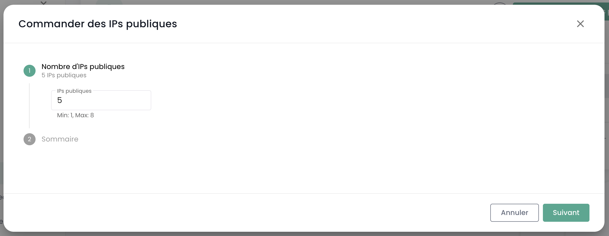
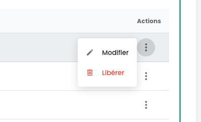

## Gestione delle tue connettività Internet

La gestione della connettività avviene tramite il menu **'Rete'** > **'Internet'**. Questo menu centralizza la gestione degli indirizzi IP, offrendo due categorie distinte:

1. **Indirizzi IP Pubblici** : sono utilizzati per esporre i tuoi servizi su Internet, facilitando così gli scambi di dati in entrata e in uscita.
2. **Indirizzi IP di Interconnessione** : questi indirizzi permettono ai tuoi gateway di dirigere il traffico verso la rete specifica di Cloud Temple, assicurando una connessione sicura ed efficiente.

Gli indirizzi IP pubblici permettono l'accesso a Internet, mentre gli indirizzi IP di interconnessione utilizzati con il protocollo BGP4 garantiscono connessioni sicure tra reti. Questi ultimi facilitano scambi affidabili e sicuri tra il tuo tenant e la rete Cloud Temple. L'uso congiunto di questi indirizzi migliora la gestione del traffico e rafforza la sicurezza e le prestazioni della rete.

Ecco l'interfaccia principale per la gestione degli indirizzi IP:

La scheda di accoglienza corrisponde al tuo ASN interno dedicato al tuo tenant. Indica in particolare le informazioni importanti per la configurazione della tua connettività BGP.

### Indirizzi IP pubblici

È possibile vedere e commentare i blocchi e gli indirizzi IP associati al tuo tenant tramite l'IPAM integrato nella console Cloud Temple:

L'ordine degli indirizzi IP pubblici si effettua tramite il pulsante **'Ordina indirizzi IP pubblici'** :

La prenotazione e l'assegnazione di un indirizzo IP avvengono tramite il pulsante **'Prenota un indirizzo'** :

La modifica o la cancellazione della prenotazione tramite i pulsanti **'Azioni'** :

Cancellare una prenotazione significa che la risorsa diventa disponibile per un altro uso, ma rimane allocata e fatturata al cliente. 

Su alcune righe, il pulsante **'Azione'** non è disponibile, indicando che gli indirizzi IP sono prenotati e quindi non disponibili per un utilizzo.

### Indirizzi IP di interconnessione

Allo stesso modo, puoi vedere e commentare i blocchi di indirizzi IP di interconnessione. Puoi visualizzare le sottoreti di interconnessione con la rete Cloud Temple e il loro utilizzo:

Puoi facilmente modificare, come per gli indirizzi pubblici, il loro utilizzo nella gestione IPAM integrata:

