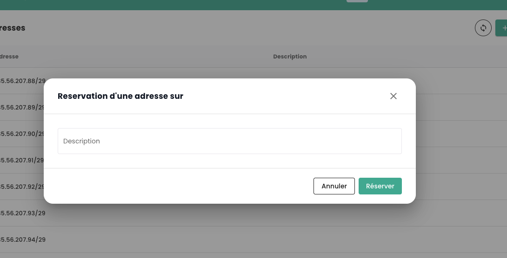

## Gestione delle vostre connettività Internet

La gestione della connettività si effettua tramite il menu **'Réseau'** > **'Internet'**. Questo menu centralizza la gestione degli indirizzi IP, offrendo due categorie distinte:

1. **Indirizzi IP Pubblici**: sono utilizzati per esporre i vostri servizi su Internet, facilitando così gli scambi di dati in entrata e in uscita.
2. **Indirizzi IP di Interconnessione**: questi indirizzi permettono alle vostre passerelle di dirigere il traffico verso la rete specifica di Cloud Temple, assicurando una connessione sicura ed efficiente.

Gli indirizzi IP pubblici permettono l'accesso a Internet, mentre gli indirizzi IP di interconnessione utilizzati con il protocollo BGP4 garantiscono connessioni sicure tra reti. Questi ultimi facilitano scambi affidabili e sicuri tra il vostro tenant e la rete Cloud Temple. L'uso congiunto di questi indirizzi migliora la gestione del traffico e rafforza la sicurezza e le prestazioni della rete.

Ecco l'interfaccia principale per la gestione degli indirizzi IP:

La scheda homepage corrisponde al vostro ASN interno dedicato al vostro tenant. Essa indica in particolare le informazioni importanti per il configurazione della vostra connettività BGP.

### Indirizzi IP pubblici

È possibile vedere e commentare i blocchi e gli indirizzi IP associati al vostro tenant tramite l'IPAM integrata alla console Cloud Temple:

L'ordine degli indirizzi IP pubblici si effettua tramite il pulsante **'Commander des IPs publiques'**:

La prenotazione e l'assegnazione di un indirizzo IP si effettuano tramite il pulsante **'Réserver une adresse'**:

La modifica o la cancellazione della prenotazione tramite i pulsanti **'Actions'**:

Cancellare una prenotazione significa che la risorsa diventa disponibile per un altro uso, ma rimane allocata e fatturata al cliente.

Su alcune linee, il pulsante **'Action'** non è disponibile, indicando che gli indirizzi IP sono prenotati e quindi non disponibili per un utilizzo.

### Indirizzi IP di interconnessione

Allo stesso modo, potete vedere e commentare i blocchi di indirizzi IP di interconnessione. Potete visualizzare le sottoreti di interconnessione con la rete Cloud Temple e il loro uso:

Potete facilmente modificare, come per gli indirizzi pubblici, il loro uso nella gestione IPAM integrata:

