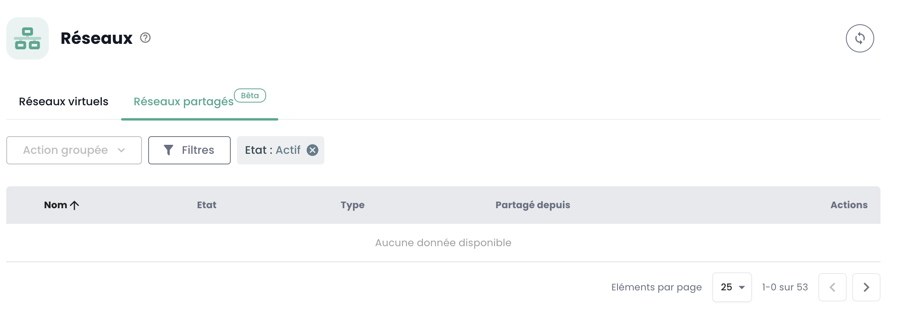

## Reti privati regionali

L'ordine delle reti private all'interno di una regione si realizza direttamente nella console Cloud Temple. 

### All'interno di un tenant

La creazione di una rete virtuale avviene nel menu __*Network*__ sulla banda verde a sinistra dello schermo.

Clicca poi sul pulsante __*Nuova rete*__

Devi specificare il nome della tua rete che sarà visualizzato. Per impostazione predefinita, l'insieme dei tuoi cluster accederanno alla tua nuova rete.
Tuttavia, nel sottomenu __*Opzioni Avanzate*__, puoi specificare più finemente l'estensione della propagazione all'interno del tenant tra i tuoi diversi cluster.

L'insieme delle azioni possibili sulle tue reti si trova nel menu __*Azioni*__ di ciascuno di esse:

- L'attivazione della condivisione di una rete tra tenant della stessa organizzazione.
- La disattivazione della condivisione di una rete tra tenant della stessa organizzazione.
- L'aggiunta di una condivisione di una rete tra tenant della stessa organizzazione.
- La rimozione di una condivisione di una rete tra tenant della stessa organizzazione.
- La visualizzazione grafica della propagazione di una rete sull'insieme dei tuoi cluster e dei tuoi hypervisor all'interno di un tenant.
- La rimozione di una propagazione all'interno di un tenant.
- La modifica di una propagazione all'interno di un tenant.
- La rimozione di una rete.

#### Visualizzazione della propagazione delle tue reti

Puoi facilmente nel menu __*Azioni*__ visualizzare per una rete la sua propagazione verso i tuoi diversi cluster all'interno di uno stesso tenant.
Scegli l'opzione *"Visualizzare la propagazione"* :

 

#### Modifica della propagazione

La modifica di una propagazione all'interno di un tenant è realizzata tramite l'opzione *"Propagare"* :
scegli poi i cluster che devono essere integrati in questa propagazione.

__*Nota:*__ *La modifica della propagazione è limitata a 20 reti per azione.*

#### Eliminazione di una rete

L'eliminazione di una rete all'interno di un tenant è realizzata tramite l'opzione *"Eliminare la rete"* :

### Condivisione di rete tra tenants

Per impostazione predefinita, __le reti sono disponibili solo all'interno di un tenant__. Puoi scegliere di __condividere una rete tra più tenants__ per ragioni tecniche o di connettività.
È possibile condividere una rete tra i tuoi __[Tenant](../../../console/iam/concepts/#tenant)__ all'interno della stessa organizzazione.

È sufficiente attivare la condivisione come mostrato di seguito.

Una volta attivata la condivisione, ti basta aggiungere una condivisione come mostrato di seguito.

Poi, seleziona il tenant di destinazione. Attenzione, la lista dei tenants è dinamica. 
Dipende dalla tua organizzazione e dai tuoi diritti.

Una volta condivisa la rete, sarà visibile nella scheda 'Reti condivise' dal tuo secondo tenant.

