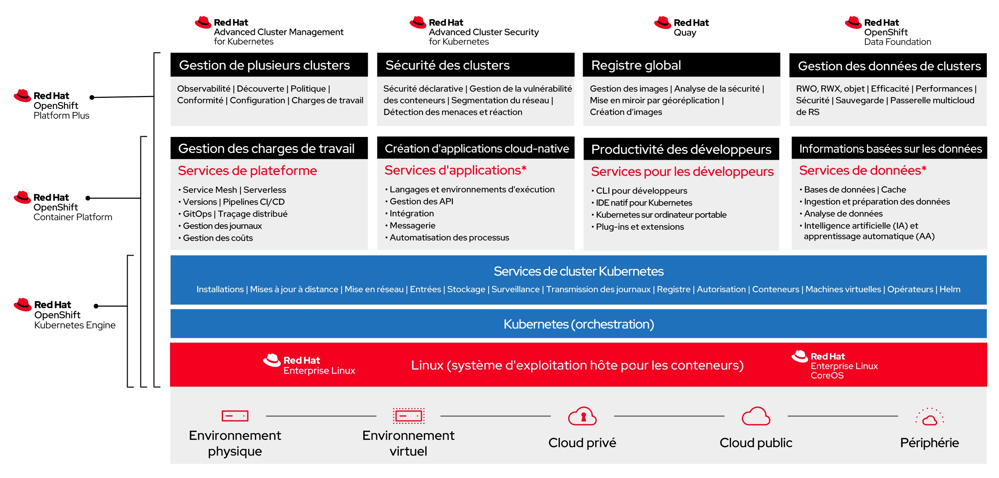

## Presentazione di RedHat Openshift

**Red Hat OpenShift** è una piattaforma di container aziendale che automatizza il deployment, la gestione e la scalabilità delle applicazioni containerizzate. È una piattaforma costruita attorno a Docker, un sistema di containerizzazione che permette di impacchettare un'applicazione e le sue dipendenze in un contenitore virtuale, e Kubernetes, un sistema di orchestrazione dei container, che gestisce l'esecuzione e il coordinamento dei container su un cluster di server.

### Funzionalità principali di Red Hat OpenShift:

- **Deployment e gestione automatizzati:** OpenShift semplifica il processo di deployment delle applicazioni automatizzando le attività di gestione come il scaling, la salute e la durata dei container. Fornisce un ambiente integrato per lo sviluppo, il testing e la produzione delle applicazioni.

- **Supporto per molteplici linguaggi e servizi:** La piattaforma supporta una vasta gamma di linguaggi di programmazione (come Java, Node.js, Python, Ruby, e PHP) e offre servizi integrati come la messaggistica, il caching e i database, permettendo agli sviluppatori di concentrarsi sul codice piuttosto che sull'infrastruttura.

- **Continuous Integration (CI) e Continuous Deployment (CD):** OpenShift integra strumenti di CI/CD che automatizzano la pipeline di sviluppo del software, dal commit iniziale al deployment in produzione, favorendo così le pratiche DevOps.

- **Gestione delle operazioni:** OpenShift fornisce strumenti per il monitoraggio, la gestione delle performance e la diagnostica delle applicazioni e delle infrastrutture, aiutando gli operatori a mantenere la salute e le performance dei sistemi.

- **Sicurezza avanzata:** La piattaforma è progettata con una sicurezza integrata, offrendo controlli di accesso basati sui ruoli, la separazione dei compiti e la gestione automatizzata dei segreti per proteggere le applicazioni e i dati.

### Vantaggi di Red Hat OpenShift:

- **Flessibilità:** Gli sviluppatori possono lavorare con gli strumenti, i linguaggi e i framework di loro scelta.
- **Efficienza operativa:** OpenShift ottimizza l'utilizzo delle risorse, riduce il tempo di commercializzazione e migliora la produttività degli sviluppatori.
- **Scalabilità:** La piattaforma gestisce automaticamente il scaling delle applicazioni per rispondere alle variazioni della domanda.
- **Sicurezza e conformità:** Con le sue politiche di sicurezza integrate, OpenShift aiuta a mantenere gli standard di sicurezza e conformità.

Red Hat OpenShift è una soluzione completa per lo sviluppo, il deployment e la gestione di applicazioni containerizzate, offrendo una piattaforma robusta, sicura e flessibile per le imprese che adottano approcci moderni di sviluppo del software.

### RedHat Openshift Data Foundation

Red Hat OpenShift Data Foundation (ODF) è una soluzione integrata di storage e gestione dei dati progettata per funzionare senza problemi con l'ecosistema OpenShift. Offre un'infrastruttura di dati persistenti, sicura e altamente disponibile per le applicazioni containerizzate, supportando così gli ambienti di sviluppo moderni incentrati sui container e i microservizi. ODF è progettata per semplificare e automatizzare la gestione dei dati in ambienti cloud ibridi e multicloud, fornendo una solida base per le applicazioni aziendali critiche.

#### Funzionalità Chiave di OpenShift Data Foundation:

- **Storage Persistente:** ODF fornisce uno strato di storage persistente per i container, essenziale per le applicazioni aziendali come i database, i sistemi di gestione dei contenuti e le applicazioni che richiedono uno stato persistente.

- **Multicloud e Ibrido:** Progettato per il cloud ibrido e multicloud, ODF permette un'esperienza di gestione dei dati coerente attraverso diversi ambienti cloud, facilitando la mobilità delle applicazioni e dei dati.

- **Automazione e Orchestrazione:** L'integrazione profonda con Kubernetes e OpenShift permette a ODF di automatizzare il provisioning, il scaling e la gestione del ciclo di vita dello storage in base alle necessità delle applicazioni.

- **Alta Disponibilità e Resilienza:** ODF utilizza la replica e il snapshotting dei dati per garantire l'alta disponibilità e la durabilità dei dati, essenziali per la continuità delle operazioni aziendali.

- **Sicurezza dei Dati:** La soluzione integra funzionalità di sicurezza avanzate, come la crittografia dei dati a riposo e in transito, oltre a politiche di sicurezza e conformità personalizzabili.

#### Vantaggi di OpenShift Data Foundation:

- **Flessibilità Operativa:** ODF permette alle imprese di gestire efficacemente i propri dati in ambienti distribuiti, offrendo la flessibilità necessaria per rispondere ai requisiti in evoluzione delle applicazioni moderne.

- **Semplificazione della Gestione dei Dati:** Automatizzando molte attività di gestione dei dati, ODF riduce la complessità e libera le risorse IT per concentrarsi su iniziative a maggior valore aggiunto.

- **Ottimizzazione dei Costi:** La capacità di ODF di adattarsi dinamicamente alle necessità di storage aiuta a ottimizzare i costi evitando il sovraprovisioning e utilizzando più efficacemente le risorse disponibili.

- **Miglioramento delle Performance:** ODF è progettata per fornire elevate performance per le applicazioni aziendali, con capacità di ottimizzazione per diversi tipi di carichi di lavoro.

Red Hat OpenShift Data Foundation è una soluzione avanzata di storage dei dati che rafforza l'efficienza, la resilienza e la sicurezza delle applicazioni aziendali deployati su OpenShift. Offrendo uno storage persistente, automatizzato e sicuro, ODF gioca un ruolo cruciale nell'abilitare le imprese a sfruttare appieno il potenziale delle tecnologie di container e cloud ibrido.

## Architettura generale della piattaforma 

### Generalità

La piattaforma Red Hat OpenShift di Cloud Temple è progettata come un'offerta regionale, distribuita nativamente su **tre zone di disponibilità distinte** all'interno della stessa regione di Cloud Temple. Questa architettura tri-zonale aumenta significativamente la disponibilità e la resilienza dei dati.

La piattaforma si compone di un piano di controllo e nodi di lavoro, tutti gestiti dall'infrastruttura Cloud Temple. Il piano di controllo è distribuito equamente sulle tre zone di disponibilità, assicurando una gestione centralizzata e sicura. I nodi di lavoro, invece, sono rappresentati da blade di calcolo, disposte in modo che ogni zona di disponibilità ne contenga una.

Per i nodi di lavoro, sono disponibili diversi tipi di blade di calcolo, permettendo così un adattamento flessibile a vari bisogni operativi:

| Unità d'opera Redhat Openshift 4 with Data Foundations - On Demand - 1 month                                                | Unità                   | SKU                                   |
| :------------------------------------------------------------------------------------------------------------------------- | :---------------------- | :------------------------------------ |
| OPENSHIFT - Piano di controllo - 3 nodi - Regione FR1                                                                      | 1 piano dedicato        | csp:fr1:paas:oshift:plan:payg:v1      |
| OPENSHIFT - WORKER NODES - TINY - 3 x ( 10 cores / 20 threads - 64 GB di ram - 512 Gio FLASH 1500 iops)                    | 3 workers dedicati      | csp:fr1:paas:oshift:wkr:tiny:payg:v1  |
| OPENSHIFT - WORKER NODES - SMALL - 3 x ( 20 cores / 40 threads - 128 GB di ram - 512 Gio FLASH 1500 iops)                  | 3 workers dedicati      | csp:fr1:paas:oshift:wkr:small:payg:v1 |
| OPENSHIFT - WORKER NODES - STANDARD - 3 x ( 32 cores / 64 threads - 384 GB di ram - 512 Gio FLASH 1500 iops)               | 3 workers dedicati      | csp:fr1:paas:oshift:wkr:std:payg:v1   |
| OPENSHIFT - WORKER NODES - ADVANCED - 3 x ( 48 cores / 96 threads - 768 GB di ram - 512 Gio FLASH 1500 iops)               | 3 workers dedicati      | csp:fr1:paas:oshift:wkr:adv:payg:v1   |
| OPENSHIFT - WORKER NODES - PERF - 3 x ( 56 cores / 112 threads - 1.5 TB di ram - 512 Gio FLASH 1500 iops)                  | 3 workers dedicati      | csp:fr1:paas:oshift:wkr:perf:payg:v1  |
| OPENSHIFT - WORKER NODES - GPU - 3 x ( 32 cores / 64 threads - 512 GB di ram - 512 Gio FLASH 1500 iops - 2xNVIDIA L40S 48GO) | 3 workers dedicati + GPUs | csp:fr1:paas:oshift:wkr:gpu:payg:v1   |

I prodotti Red Hat OpenShift Cloud Temple sono disponibili in pagamento a consumo o in prenotazione di 12 mesi.

**Note**: 

1. *Il mantenimento della condizione operativa e di sicurezza del piano di controllo è responsabilità di Cloud Temple a titolo di un servizio PaaS.*

2. *Al 15 giugno 2024, la versione 1 della piattaforma è volutamente limitata software per un piano di controllo a 30 workers nodes (qualsiasi sia il tipo di worker) e a uno storage persistente globale di 50 Tio. Se queste limitazioni bloccano il vostro progetto, vi preghiamo di contattare il supporto.*

3. *Ogni worker node è fornito con 512Gio di storage flash Bloc, che fa 1.5 Tio per ogni unità d'opera (1 worker per AZ).*

4. *L'offerta PaaS Openshift include nativamente l'accesso alle 3 zone di disponibilità, senza necessità di sottoscriverle aggiuntivamente.*

5. *È possibile aggiungere successivamente dello storage blocco al cluster Openshift.*

6. *I nodi sono distribuiti uniformemente tra le 3 zone di disponibilità (1 nodo per zona). Non è possibile sbilanciare un cluster assegnando un numero maggiore di nodi a una sola zona.*
### Offre RedHat déployée dans le cadre de la plateforme Openshift Cloud Temple

La plateforme est une Redhat Openshift 4 basée sur [RedHat Openshift Platform Plus](https://www.redhat.com/en/technologies/cloud-computing/openshift/platform-plus) et inclut [OpenShift DataFoundation Essential](https://www.redhat.com/en/resources/add-capabilities-enterprise-deployments-datasheet). 

## Strategia di backup della tua piattaforma PaaS Openshift

Il backup e il ripristino della piattaforma PaaS Openshift sono responsabilità di Cloud Temple per la parte **ETCD** in termini di gestione della piattaforma. **Il backup e il ripristino per la parte di deployment e dati applicativi sono responsabilità del Committente**.

RedHat Openshift Plateform Plus include l'**API Openshift Data Protection (OADP)** e mette nativamente a disposizione **Velero**. Troverete qui la documentazione completa sull'argomento (in inglese): [Backing up and restoring your OpenShift Container Platform cluster](https://docs.redhat.com/fr/documentation/openshift_container_platform/4.8/html/backup_and_restore/index). *(1)*

Cloud Temple mette a disposizione in opzione per i suoi clienti l’offerta **Veeam Kasten K10** (Veeam [**Kasten K10**](https://www.veeam.com/fr/kubernetes-native-backup-and-restore.html)), piattaforma specializzata nella gestione dei dati per gli ambienti Kubernetes. Progettata per rispondere alle esigenze in materia di protezione dei dati, offre funzionalità robuste per il backup, il ripristino, la migrazione e la ripresa dopo i disastri. Kasten K10 si integra in modo nativo con gli ambienti Kubernetes, siano essi gestiti su cluster cloud o on-premise, e può adattarsi a diversi casi d'uso, in particolare la migrazione di cluster tra diverse distribuzioni Kubernetes come Kubernetes Vanilla, VMware Tanzu, Red Hat Kubernetes Engine e Red Hat OpenShift.

Uno dei casi d'uso principali di Kasten K10 è **la migrazione dei cluster tra diverse piattaforme Kubernetes**. Sia per una transizione verso un'infrastruttura più robusta o per consolidare gli ambienti esistenti, Kasten K10 offre strumenti semplici ed efficaci per gestire queste migrazioni:

 - **Backup e protezione dei dati**: Durante la migrazione di un cluster Kubernetes Vanilla o VMware Tanzu verso Red Hat Kubernetes Engine o OpenShift, il primo passo è eseguire il backup dei dati delle applicazioni e dei loro stati. Kasten K10 si integra facilmente con le API Kubernetes per identificare le applicazioni, le loro dipendenze e i volumi dei dati associati. Questo include il backup dei volumi persistenti (Persistent Volumes - PV), dei database, delle configurazioni e dei segreti. Kasten K10 supporta una vasta gamma di fornitori di storage (S3, Google Cloud Storage, Azure Blob Storage, etc.), permettendo di creare snapshot delle applicazioni da migrare. Questi backup sono poi archiviati in modo sicuro con opzioni di crittografia e controllo degli accessi granulari, garantendo la sicurezza dei dati durante tutto il processo.

 - **Portabilità e migrazione**: La migrazione tra distribuzioni Kubernetes come Vanilla o Tanzu e soluzioni Red Hat come OpenShift o Kubernetes Engine può essere complessa a causa delle differenze architettoniche e delle configurazioni specifiche di ogni piattaforma. Kasten K10 semplifica questo processo fornendo uno strato di astrazione per la portabilità delle applicazioni. Durante la migrazione, Kasten K10 replica le configurazioni e i dati da un cluster di origine a un cluster di destinazione, tenendo conto delle specificità di ogni ambiente. Ad esempio, gli oggetti Kubernetes come ConfigMap, Secrets, PV e CRD (Custom Resource Definitions) possono essere migrati tenendo conto delle restrizioni proprie di ogni distribuzione Kubernetes, che si tratti di un cluster Red Hat OpenShift o Kubernetes Engine. Il processo è automatizzato, riducendo significativamente il rischio di errori manuali. Inoltre, Kasten K10 permette una migrazione progressiva o completa, a seconda delle necessità, e offre visibilità in tempo reale sullo stato della migrazione, facilitando la gestione e il monitoraggio della transizione.
   
 - **Compatibilità multi-cloud e multi-distribuzione**: Kasten K10 è progettato per funzionare in ambienti ibridi e multi-cloud, rendendolo uno strumento ideale per le organizzazioni che cercano di migrare applicazioni da cluster Tanzu o Vanilla verso ambienti Red Hat nel cloud (Cloud Temple, Amazon EKS, Azure AKS, Google GKE) o su infrastrutture on-premise. Questo garantisce una flessibilità massima e permette ai team DevOps di scegliere l'ambiente migliore in base alle necessità aziendali o alle strategie di modernizzazione dell'infrastruttura.
   
 - **Gestione semplificata e automazione**: Kasten K10 offre un'interfaccia utente intuitiva che permette agli amministratori di gestire facilmente le operazioni di migrazione e backup senza richiedere una conoscenza approfondita di ogni piattaforma Kubernetes. La soluzione è inoltre equipaggiata con funzionalità di automazione che permettono di definire politiche di migrazione e backup ricorrenti, integrandosi con i pipeline CI/CD per operazioni continue. Gli utenti possono pianificare migrazioni o ripristini in base alle finestre di manutenzione, eseguire test di validazione dopo la migrazione e automatizzare i processi di failover in caso di problemi sul cluster di origine.
   
 - **Sicurezza e conformità**: Nel contesto della migrazione verso ambienti critici come Red Hat OpenShift o Kubernetes Engine, la sicurezza dei dati e la conformità agli standard (ISO, SOC, GDPR, etc.) sono aspetti essenziali. Kasten K10 assicura la crittografia dei dati in transito e a riposo, offrendo opzioni di audit e tracciabilità delle operazioni di backup e ripristino. Queste capacità sono essenziali per garantire la sicurezza dei dati migrati, sia negli ambienti di produzione che di test. Kasten K10 è una soluzione imprescindibile per le aziende che desiderano migrare in modo efficace e sicuro cluster Kubernetes Vanilla o VMware Tanzu verso Red Hat Kubernetes Engine o OpenShift.

 La fatturazione è basata sul numero di worker node.

| Unità operative Redhat Openshift 4 with Data Foundations - Worker Node Backup Solution | Unità     | SKU                         |
| :------------------------------------------------------------------------------------ | :-------- | :-------------------------- |
| VEEAM - KASTEN K10 - Kubernetes data protection and application mobility              | 3 workers | csp:fr1:paas:kasten:3wkr:v1 |
   
**Nota**: *Attenzione, è necessario prevedere la volumetria del disco necessaria per il corretto funzionamento del tuo backup nell'ambiente di ricezione del backup, generalmente in storage S3. Essa non è inclusa nelle unità operative Openshift o Kasten.*

**(1)** _OADP non è installato nativamente nel cluster. Solo Kasten è attivato per la gestione delle migrazioni, dei backup e del ripristino._

## Diritti e Permessi 

Ecco i principali permessi implementati:

|       Gruppo       |         d'API          |                                                                                      Risorse Permessi                                                                                      |
|--------------------|------------------------|-------------------------------------------------------------------------------------------------------------------------------------------------------------------------------------------|
|        Core        |       ("")/Apps        |ConfigMaps, Endpoints, PersistentVolumeClaims, Pods, ReplicationControllers, Secrets, Services, DaemonSets, Deployments, ReplicaSets, StatefulSets, Create, Get, List, Watch, Update, Patch, Delete |
|        Core        |          ("")          |                                                                                          Secrets Create                                                                                          |
|config.kio.kasten.io|        Profiles        |                                                                          Get, List, Watch, Create, Update, Patch, Delete                                                                           |
|config.kio.kasten.io|     PolicyPresets,     |                                                TransformSets, BlueprintBindings, StorageSecurityContexts, StorageSecurityContextBindings Get, List                                                 |
|config.kio.kasten.io|         Toutes         |                                                                                    le risorse (*) Get, List                                                                                    |
|       Batch        |       CronJobs,        |                                                                       Jobs Create, Get, List, Watch, Update, Patch, Delete                                                                        |
|    Autoscaling     |HorizontalPodAutoscalers|                                                                          Create, Get, List, Watch, Update, Patch, Delete                                                                           |
|     Networking     |       Ingresses,       |                                                                     NetworkPolicies Create, Get, List, Watch, Update, Patch, Delete                                                                   |
|       Policy       |  PodDisruptionBudgets  |                                                                          Create, Get, List, Watch, Update, Patch, Delete                                                                           |
|       Route        |      (OpenShift)       |                                                                       Routes Create, Get, List, Watch, Update, Patch, Delete                                                                       |
|       Build        |      (OpenShift)       |                                                          BuildConfigs, Builds, BuildLogs Create, Get, List, Watch, Update, Patch, Delete                                                           |
|       Image        |      (OpenShift)       |                                                           ImageStreams, ImageStreamTags Create, Get, List, Watch, Update, Patch, Delete                                                            |
|        Apps        |      (OpenShift)       |                                                                 DeploymentConfigs Create, Get, List, Watch, Update, Patch, Delete                                                                  |
|      Template      |      (OpenShift)       |                                                            Templates, TemplateInstances Create, Get, List, Watch, Update, Patch, Delete                                                            |
|   Authorization    |         Roles,         |                                                                    RoleBindings Create, Get, List, Watch, Update, Patch, Delete                                                                    |
|        RBAC        |         Roles,         |                                                                    RoleBindings Create, Get, List, Watch, Update, Patch, Delete                                                                    |
|      Project       |      (OpenShift)       |                                                                                Projects Get, Delete, Update, Patch                                                                                 |
|     Operators      |     Subscriptions,     |                                        ClusterServiceVersions, CatalogSources, InstallPlans, OperatorGroups Create, Get, List, Watch, Update, Patch, Delete                                        |
|    Cert-Manager    |     Certificates,      |                                                    CertificateRequests, Issuers, ClusterIssuers Create, Get, List, Watch, Update, Patch, Delete                                                    |
|      Logging       |      (OpenShift)       |                                                       ClusterLogForwarders, ClusterLoggings Create, Get, List, Watch, Update, Patch, Delete                                                        |
|      Storage       |    VolumeSnapshots     |                                                                          Get, List, Watch, Create, Update, Patch, Delete                                                                           |
|        Ceph        |         (Rook)         |                                          CephClusters, CephBlockPools, CephFilesystems, CephObjectStores Create, Get, List, Watch, Update, Patch, Delete                                           |
|       NooBaa       |     BackingStores,     |                                                           BucketClasses, NooBaaAccounts Create, Get, List, Watch, Update, Patch, Delete                                                            |
|    ObjectBucket    |  ObjectBucketClaims,   |                                                                   ObjectBuckets Create, Get, List, Watch, Update, Patch, Delete                                                                    |
|        OCS         |      (OpenShift)       |                                                         StorageClusters, StorageConsumers Create, Get, List, Watch, Update, Patch, Delete                                                          |
|       Local        |        Storage         |                                                        LocalVolumes, LocalVolumeDiscoveries Create, Get, List, Watch, Update, Patch, Delete                                                        |
|        CSI         |         Addons         |                                                           CSIAddonsNodes, NetworkFences Create, Get, List, Watch, Update, Patch, Delete                                                            |
|      Metrics       |         Pods,          |                                                                                             Nodes Get                                                                                              |
|      Security      |PodSecurityPolicyReviews|                                                                                               Create                                                                                               |
|       Custom       |       Resources        |                                       Diverse risorse personalizzate legate a Kasten K10, Keycloak, ecc. Create, Get, List, Watch, Update, Patch, Delete                                        |

## Limiti attuali dell'offerta Redhat Openshift in ambiente SecNumCloud

Ecco alcune limitazioni indotte dalla qualificazione SecNumCloud:

### Piano di controllo dedicato

I carichi di lavoro non possono essere eseguiti sul piano di controllo a causa delle restrizioni inerenti alla gestione delle risorse e alla sicurezza della piattaforma OpenShift su SecNumCloud.

### Divieto di distribuire immagini con privilegi elevati (rootless)

Per conformarsi ai requisiti di sicurezza del repository SecNumCloud, è obbligatorio utilizzare container senza privilegi (`rootless`).

Questo approccio rafforza la sicurezza generale impedendo qualsiasi accesso privilegiato ai container. Le applicazioni che richiedono container con privilegi dovranno essere modificate, poiché il loro deployment non sarà consentito.

Questa restrizione si estende anche agli `Helm Charts` e agli operatori che utilizzano immagini non rootless, rendendo il loro deployment impossibile all'interno dell'infrastruttura.

### Restrizioni sui diritti dei ClusterRole

Nell'ambito della nostra offerta OpenShift, abbiamo implementato una gestione rigorosa dei diritti di accesso a livello di cluster, in conformità con i requisiti SecNumCloud.

Questo approccio implica una limitazione dei ClusterRoles per i nostri clienti, limitando così alcuni aspetti della gestione globale del cluster. Anche se questa misura può inizialmente sembrare restrittiva, mira a rafforzare la sicurezza e la stabilità dell'infrastruttura.

Siamo consapevoli che ciò potrebbe comportare delle sfide tecniche, in particolare nella configurazione dei parametri avanzati, e potenzialmente delle implicazioni legate all'adattamento delle applicazioni o all'acquisizione di strumenti complementari.

Il nostro team di supporto è disponibile per guidarvi e consigliarvi su questo argomento.

### Il contesto SCC non può essere modificato nell'ambiente SecNumCloud

Le `Security Context Constraints (SCC)` sono soggette a restrizioni severe e non possono essere modificate dagli utenti. Questa limitazione ha effetti significativi sul deployment e l'esecuzione dei container.

In pratica, ciò significa che i parametri di esecuzione dei container, come i privilegi di accesso al sistema o le capacità Linux, sono predefiniti e non personalizzabili.

Questa misura, motivata da requisiti di sicurezza, mira a impedire qualsiasi accesso non autorizzato alle risorse critiche del cluster. Di conseguenza, le applicazioni che richiedono contesti di sicurezza specifici, in particolare quelle che richiedono accessi privilegiati, potrebbero incontrare ostacoli durante il deployment.

Da un punto di vista tecnico, ciò potrebbe implicare una revisione dell'architettura delle applicazioni e un adattamento dei processi di deployment per conformarsi alle SCC predefinite. Sul piano operativo, questo vincolo può ridurre la flessibilità dei deployment e aumentare la complessità di gestione di alcune applicazioni nell'ambiente OpenShift, in particolare quelle che utilizzano Helm Charts o operatori che non rispettano le SCC in vigore.

### Limitazioni sulle Custom Resource Definitions (CRDs)

Per conformarsi alla qualificazione SecNumCloud, una restrizione importante riguarda l'uso delle `Custom Resource Definitions (CRDs)` e dei controller personalizzati. Questa misura, legata ai diritti sul cluster, mira a prevenire il deployment di risorse personalizzate potenzialmente instabili o non autorizzate.

Questa limitazione si applica anche agli operatori e agli Helm Charts, con un impatto diretto sui diritti `RBAC`, poiché le CRDs consentono di estendere l'API Kubernetes. Di conseguenza, gli operatori e gli Helm Charts devono passare attraverso una catena di certificazione presso i nostri servizi per garantire la loro conformità e sicurezza.

Le CRDs personalizzate, in particolare quelle che rispondono a esigenze aziendali specifiche, possono essere rifiutate nell'infrastruttura a causa dei rischi che presentano per la stabilità e la sicurezza della piattaforma. Questa politica, progettata per proteggere l'integrità e l'affidabilità del cluster, consente solo le CRDs provenienti da operatori o Helm Charts ufficialmente certificati.

Il nostro team di supporto è disponibile per guidarvi e consigliarvi sulle migliori pratiche da adottare in questo contesto.

### Nessun supporto per IP dinamici per i runners
La piattaforma OpenShift SecNumCloud richiede che i runner siano configurati con indirizzi IP fissi. Questa esigenza è motivata dalla necessità di autorizzare gli IP che amministrano la nostra console Cloud Temple, necessaria per lo strumento di gestione degli accessi alle API. Gli indirizzi IP autorizzati sono utilizzati anche per accedere all'API OpenShift così come alle interfacce di amministrazione di OpenShift e Shiva.

Pertanto, l'uso di indirizzi IP dinamici non è supportato per questi componenti, imponendo la configurazione di IP fissi al fine di garantire la sicurezza e l'accesso alle API.

## Bilanciatori di carico

L'ambiente SecNumCloud OpenShift offre opzioni di Load Balancing a diversi livelli per garantire una gestione sicura ed efficace del traffico. L'API del Load Balancer è accessibile tramite le porte 6443 e 443, con un controllo di sicurezza garantito da una lista bianca gestita dalla console Cloud Temple. Questa API utilizza un indirizzo IP pubblico connesso al nostro backbone, ma non è accessibile di default, rafforzando così la sicurezza degli accessi.

Per il Load Balancer privato, l'ambiente utilizza Ingress (nginx) come soluzione predefinita, permettendo di gestire il traffico interno in maniera efficace. Inoltre, è disponibile un supporto TCP tramite l'infrastruttura IaaS di Cloud Temple, offrendo così un'ulteriore flessibilità per le applicazioni che necessitano di un bilanciamento del carico a questo livello.

Per quanto riguarda il Load Balancer pubblico, il supporto di livello 4 è garantito tramite Ingress, sebbene alcune limitazioni esistano attualmente con il comando "expose." Ciò significa che il sistema è in grado di gestire connessioni TCP e UDP in maniera affidabile mentre continua a evolversi per offrire una maggiore compatibilità e flessibilità.