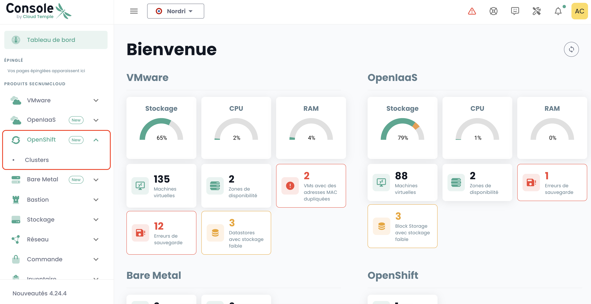

## Déployer une plateforme Redhat Openshift au sein de votre tenant

### Affectation des droits d'accès

Il est indispensable que l'administrateur du [Tenant](../console/iam/concepts.md#tenants) accorde le droit de gestion de la plateforme Openshift à l'utilisateur administrateur Openshift pour pouvoir y accéder :


### Accès à l'environnement Openshift au sein d'un tenant

Après l'affectation des droits, le module '__Openshift__' apparaît alors dans le menu de la console Cloud Temple :



Vous voyez alors apparaître les clusters Openshift qui sont déployés au sein de votre tenant.

Cliquez sur le cluster que vous souhaitez administrer. Vous accéder à l'environnement d'administration du cluster :


Après authentification, vous pouvez administrer votre cluster :


### Risorse del tuo ambiente

Ecco le informazioni di connessione e di configurazione del tuo ambiente OpenShift.

#### Dettagli di connessione

Per accedere ai diversi componenti OpenShift, assicurati che il tuo tenant sia iscritto nella lista bianca della console (consulta la documentazione: [Cloud Temple Documentation](https://docs.cloud-temple.com/)).

- __URL Shiva Tenant__ :  
  [https://**vostro-id-tenant**.shiva.cloud-temple.com/](https://**vostro-id-tenant**.shiva.cloud-temple.com/)  
  
- __OpenShift UI__ :  
  [https://ui-ocp01-**vostro-id**.paas.cloud-temple.com/](https://ui-ocp01-**vostro-id**.paas.cloud-temple.com/)  
  
- __API esterna__ :  
  [https://api-ocp01-**vostro-id**.paas.cloud-temple.com](https://api-ocp01-**vostro-id**.paas.cloud-temple.com)  
  
- __GitOps (ARGOCD)__ :  
  [https://gitops-ocp01-**vostro-id**.paas.cloud-temple.com/applications](https://gitops-ocp01-**vostro-id**.paas.cloud-temple.com/applications)  
  
#### Connessione al cluster via CLI

Per connetterti tramite la linea di comando (CLI), usa il seguente comando :

```bash
oc login https://api-ocp01-{vostro-id}.paas.cloud-temple.com/ --web
```

#### Accesso al registro

Per accedere al registro, effettua il login utilizzando i seguenti comandi :

```bash
oc login https://api-ocp01-{vostro-id}.paas.cloud-temple.com --web
docker login -u {vostro-utente} -p $(oc whoami -t) registry-ocp01-{vostro-id}.paas.cloud-temple.com
```

Successivamente, testa la costruzione e il caricamento di un'immagine Docker :

```bash
docker build -t <namespace>/temp:latest .
docker tag <namespace>/temp:latest registry-ocp01-{vostro-id}.paas.cloud-temple.com/<namespace>/temp:latest
docker push registry-ocp01-{vostro-id}.paas.cloud-temple.com/<namespace>/temp:latest
```

#### Configurazione dei router e Load Balancer

La piattaforma offre opzioni flessibili per il __routing dei flussi__ e il __bilanciamento del carico__ :

- Di default, i load balancer privati vengono utilizzati per le rotte e gli ingresses.  
- Domini :  
  - `*.apps-priv-ocp01-{vostro-id}.paas.cloud-temple.com`  
  - `*.apps-ocp01-{vostro-id}.paas.cloud-temple.com`  

Assicurati che le tue rotte o gli ingresses siano configurati con le etichette o le classi di ingress appropriate per garantire un corretto routing. 

Esempio :

```yaml
metadata:
  labels:
    ct-router-type: public
```

#### Interconnessione IaaS

Le configurazioni di rete giocano un ruolo cruciale per la sicurezza delle comunicazioni con OpenShift.

- __Rete di interconnessione__ : 100.67.0.0/28  
- __VIP del load balancer privato__ : 100.67.0.3  

Verifica che il tuo firewall disponga di un'interfaccia dedicata e autorizzi il traffico tra le reti specificate.