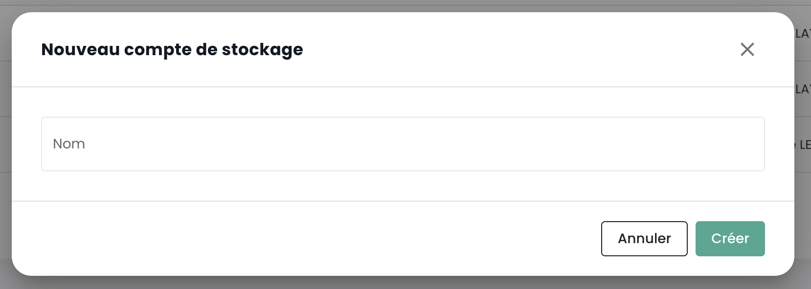
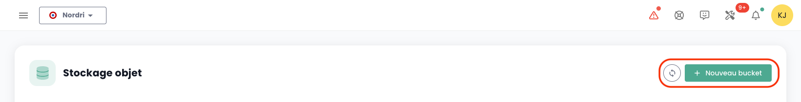
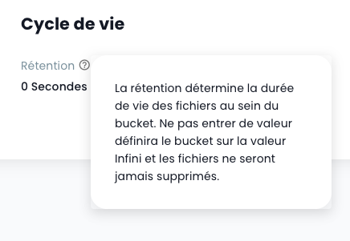
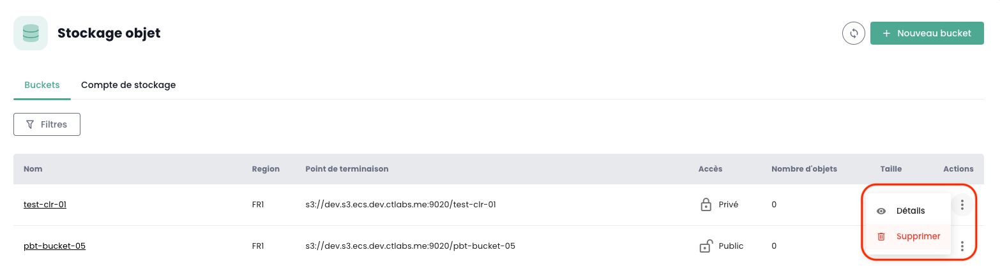

## Elencare tutti i bucket S3 del tuo tenant

Puoi accedere a tutti i tuoi bucket tramite il menu '__Storage Oggetti__' della console Cloud Temple:


Puoi vedere tutti gli account creati sul tuo tenant e autorizzati ad accedere al servizio S3 tramite la scheda '__Account di storage__'.


## Creazione di un nuovo account di storage

La creazione di un account di storage sul tuo tenant si effettua premendo il pulsante '__Nuovo account di storage__' in alto a destra, nella scheda '__Account di storage__':



La piattaforma ti fornisce quindi la chiave di accesso e la chiave segreta del tuo bucket:


__ATTENZIONE:__ Le chiavi segreta e di accesso vengono presentate una sola volta. Dopo questa prima apparizione, diventa impossibile consultare nuovamente la chiave segreta. È quindi essenziale annotare queste informazioni immediatamente; in caso contrario, sarà necessario generare una nuova coppia di chiavi.

La rigenerazione si effettua a livello delle opzioni della chiave scegliendo l'opzione "Reimposta chiave di accesso".


## Creazione di un bucket S3

La creazione di un nuovo bucket si effettua cliccando sul pulsante '__Nuovo bucket__' in alto a destra dello schermo:



Appare una finestra e devi fornire:

1. La **regione** di creazione del tuo bucket,
2. Il **tipo** di bucket: prestazioni o archiviazione,
3. Il **nome** del tuo bucket (deve essere unico).


Al 3 aprile 2024, la regione disponibile è **FR1** (Parigi) e solo il tipo prestazioni è disponibile.

Devi anche scegliere chi può accedere al tuo bucket:

- Accesso **Privato**: Per impostazione predefinita, l'accesso è limitato agli indirizzi IP specifici di Cloud Temple.
- Accesso **Pubblico**: L'accesso è aperto a tutti gli indirizzi Internet (in particolare tramite la regola 0.0.0.0/0). Sconsigliamo questa configurazione a causa delle sue implicazioni in termini di sicurezza.
- Accesso **Personalizzato**: Questa opzione ti permette di specificare gli indirizzi IPv4 o gli intervalli di sottoreti che desideri autorizzare.

## Associazione di un account di storage a un bucket

Le associazioni di account ai bucket vengono realizzate nella scheda '__Politiche__'


Questa associazione permette di dare accesso dell'account di storage al bucket. Ci sono quattro ruoli:

1. **Manutentore**: Diritti di lettura, scrittura, gestione dei diritti e gestione delle politiche.

I permessi S3 dietro questo ruolo:
```json
{
    "name": "maintainer",
    "permissions": [
        "s3:*"
    ]
}
```

2. **Scrittore e Lettore**: Leggere e modificare, modificare, eliminare i file nei buckets.

I permessi S3 dietro questo ruolo:
```json
{
    "name": "read_write",
    "permissions": [
        "s3:Get*"
        "s3:List*"
        "s3:*Object"
    ]
}
```

3. **Scrittore**: Leggere e modificare, modificare, eliminare i file nei buckets.

I permessi S3 dietro questo ruolo:
```json
{
    "name": "write_only",
    "permissions": [
        "s3:List*"
        "s3:*Object"
    ]
}
```

4. **Lettore**: Leggere i file nei buckets e scaricarli.

I permessi S3 dietro questo ruolo:
```json
{
    "name": "read_only",
    "permissions": [
        "s3:Get*"
        "s3:List*"
    ]
}
```


## Esplorare un bucket S3

Quando fai clic sul nome di un bucket, accedi prima alla scheda '__File__' per vedere il suo contenuto:


Nella scheda '__Impostazioni__' puoi vedere i dettagli delle informazioni del tuo bucket S3:


Qui puoi vedere:

1. Il nome del bucket S3,
2. La sua regione,
3. Il numero di oggetti che contiene e la dimensione in byte del bucket,
4. Il suo endpoint,
5. I parametri del ciclo di vita che, in particolare, definiscono la scadenza degli oggetti del bucket. '__0__' corrisponde a una conservazione infinita.

Puoi modificare il parametro di conservazione tramite il pulsante '__Modifica__' del ciclo di vita:



Infine, puoi modificare la sua tipologia di accesso.

## Limitazioni di accesso ai tuoi bucket S3

È molto semplice configurare le restrizioni di accesso ai tuoi bucket S3. Quando crei un bucket, hai la possibilità di scegliere tra tre configurazioni di accesso:


- Accesso **Privato**: Per impostazione predefinita, l'accesso è limitato agli indirizzi IP specifici di Cloud Temple.
- Accesso **Pubblico**: L'accesso è aperto a tutti gli indirizzi Internet (in particolare tramite la regola 0.0.0.0/0). Sconsigliamo questa configurazione a causa delle sue implicazioni in termini di sicurezza.
- Accesso **Personalizzato**: Questa opzione ti permette di specificare gli indirizzi IPv4 o gli intervalli di sottoreti che desideri autorizzare:


*Il supporto IPv6 è previsto per il primo semestre del 2025.*

## Eliminazione di un bucket S3

L'eliminazione di un bucket si effettua nelle azioni associate al bucket scegliendo l'opzione __'Elimina'__.



_**ATTENZIONE: L'eliminazione è definitiva e non esiste alcun modo per recuperare i dati.**_


## Come viene fatturata l'offerta S3 di Cloud Temple?

Il prezzo è un prezzo mensile, al GiB di storage, fatturato mensilmente. Tuttavia, la piattaforma contabilizza l'uso all'ora e realizza la fatturazione su una base mensile di 720 ore.

Per esempio, se consumate nel mese 30 GiB per 1 ora poi niente, poi qualche giorno più tardi 30 GiB per 2 ore, la fattura mensile sarà di *( Prezzo (1 x 30 GiB) + 2 x Prezzo (30 GiB) ) / 720* sul mese considerato. La fatturazione è a termine scaduto.
