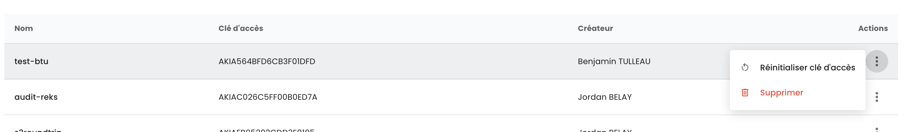
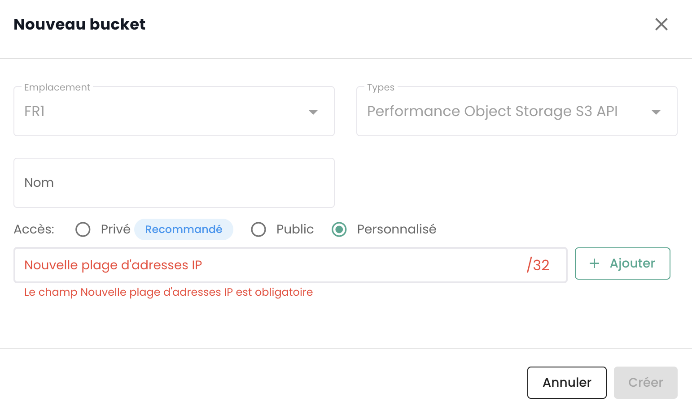

## Elenco di tutti i bucket S3 del tuo tenant

Puoi accedere a tutti i tuoi bucket tramite il menu '__Object Storage__' della console Cloud Temple:

Puoi vedere tutti gli account creati sul tuo tenant e autorizzati ad accedere al servizio S3 tramite la scheda '__Account di archiviazione__'.

## Creazione di un nuovo account di archiviazione

La creazione di un account di archiviazione sul tuo tenant avviene premendo il pulsante '__Nuovo account di archiviazione__' in alto a destra, nella scheda '__Account di archiviazione__':

La piattaforma ti fornirà quindi la chiave di accesso e la chiave segreta del tuo bucket:

__ATTENZIONE:__ Le chiavi segreta e di accesso vengono presentate una sola volta. Dopo questa prima apparizione, diventa impossibile consultare nuovamente la chiave segreta. È quindi essenziale annotare queste informazioni immediatamente; altrimenti, sarà necessario generare una nuova coppia di chiavi.

La rigenerazione avviene a livello delle opzioni delle chiavi scegliendo l'opzione "Reimposta chiave di accesso".

## Creazione di un bucket S3

La creazione di un nuovo bucket avviene facendo clic sul pulsante '__Nuovo bucket__' in alto a destra dello schermo:

Apparirà quindi una finestra in cui dovrai fornire:

1. La **regione** di creazione del tuo bucket,
2. Il **tipo** di bucket: performante o archiviazione,
3. Il **nome** del tuo bucket (deve essere unico).

Al 3 Aprile 2024, la regione disponibile è **FR1** (Paris) e solo il tipo performante è disponibile.

Devi anche scegliere chi può accedere al tuo bucket:

- Accesso **Privato**: Per impostazione predefinita, l'accesso è limitato agli indirizzi IP specifici di Cloud Temple.
- Accesso **Pubblico**: L'accesso è aperto a tutti gli indirizzi Internet (in particolare tramite la regola 0.0.0.0/0). Sconsigliamo questa configurazione a causa delle sue implicazioni in termini di sicurezza.
- Accesso **Personalizzato**: Questa opzione ti permette di specificare gli indirizzi IPv4 o le gamme di sottoreti che desideri autorizzare.

## Associazione di un account di archiviazione a un bucket

Le associazioni di account ai bucket vengono effettuate nella scheda '__Politiche__'

Questa associazione consente di dare accesso all'account di archiviazione al bucket. Ci sono tre ruoli:

1. **Maintainer**: I diritti di lettura, scrittura, gestione dei diritti e gestione della politica
2. **Lettore**: Leggere i file nei bucket e scaricarli.
3. **Scrittore**: Leggere e modificare, modifica, cancellare i file nei bucket.

## Esplora un bucket S3

Quando fai clic sul nome di un bucket, accedi per primo alla scheda '__File__' per vedere il suo contenuto:

Nella scheda '__Impostazioni__' puoi vedere i dettagli delle informazioni del tuo bucket S3:

Avrai quindi:

1. Il nome del bucket S3,
2. La sua regione,
3. Il numero di oggetti che contiene e la dimensione in byte del bucket,
4. Il suo endpoint,
5. I parametri del ciclo di vita che definiscono in particolare la scadenza degli oggetti del bucket. '__0__' corrisponde a un'archiviazione infinita.

Puoi modificare il parametro di conservazione tramite il pulsante '__Modifica__' del ciclo di vita:

Infine, puoi modificare la sua tipologia di accesso.

## Limitazioni degli accessi ai tuoi bucket S3

È molto semplice configurare le restrizioni di accesso ai tuoi bucket S3. Durante la creazione di un bucket, hai la scelta tra tre configurazioni di accesso:

- Accesso **Privato**: Per impostazione predefinita, l'accesso è limitato agli indirizzi IP specifici di Cloud Temple.
- Accesso **Pubblico**: L'accesso è aperto a tutti gli indirizzi Internet (in particolare tramite la regola 0.0.0.0/0). Sconsigliamo questa configurazione a causa delle sue implicazioni in termini di sicurezza.
- Accesso **Personalizzato**: Questa opzione ti permette di specificare gli indirizzi IPv4 o le gamme di sottoreti che desideri autorizzare:

*Il supporto per IPv6 è previsto per il primo semestre del 2025.*

## Eliminazione di un bucket S3

L'eliminazione di un bucket avviene nelle azioni associate al bucket scegliendo l'opzione __'Elimina'__.

_**ATTENZIONE: L'eliminazione è definitiva e non esiste alcun modo per recuperare i dati.**_

## Come viene fatturata l'offerta S3 di Cloud Temple?

Il prezzo è un prezzo mensile, al Giga di archiviazione, fatturato mensilmente. Tuttavia, la piattaforma contabilizza l'uso all'ora e realizza la fatturazione su base mensile di 720 ore.

Ad esempio, se consumi durante il mese 30 Giga per 1 ora poi nulla, poi qualche giorno dopo 30 Giga per 2 ore, la fattura mensile sarà di *( Prezzo (1 x 30 Giga) + 2 x Prezzo (30 Giga) ) / 720* sul mese considerato. La fatturazione è a termine scaduto.